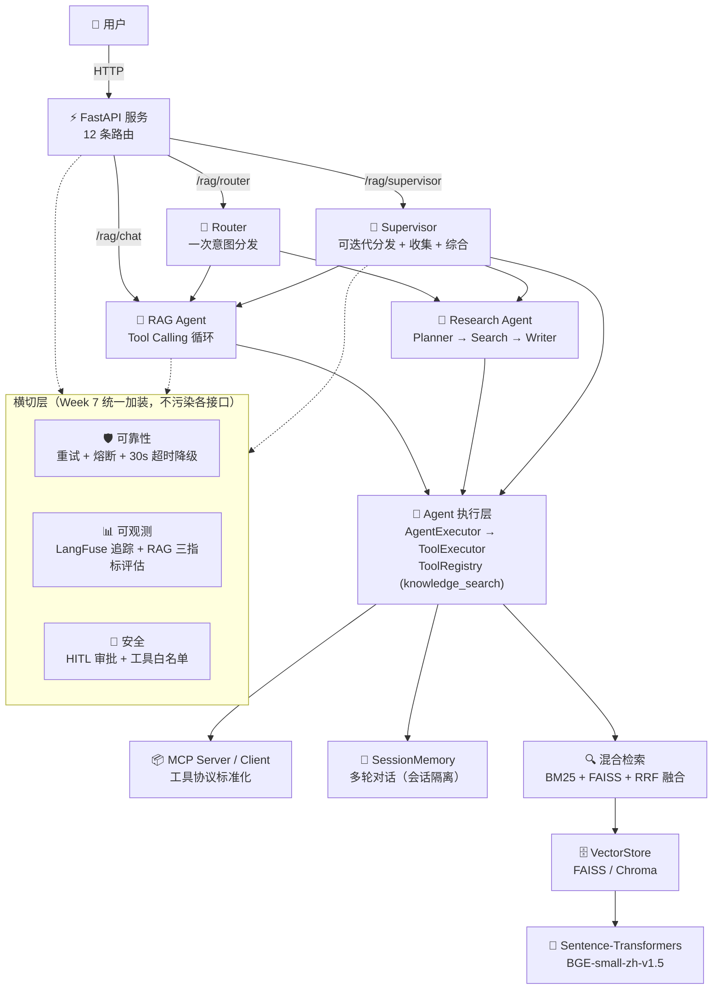

# Enterprise-RAG-Agent

基于 **FastAPI + FAISS/Chroma + Sentence-Transformers + DeepSeek LLM** 构建的企业级 RAG 知识库问答 Agent，支持 Tool Calling、多轮对话 Memory、流式输出，并整合了 **Multi-Agent（Router / Supervisor）**、**可靠性（重试 / 熔断 / 超时降级）**、**可观测（LangFuse 追踪 / 质量评估）** 与 **安全（HITL 审批 / 工具白名单）**。

---

## ✨ 项目亮点

1. **全手写 RAG Pipeline**：Loader → Splitter → Embedding → VectorStore → Retriever → Reranker → Prompt 全链路手写实现，不依赖 LangChain 等重型框架，核心算法（RRF 融合 / 重排 / 熔断）均可手撕。
2. **企业级 Agent 工程闭环**：从单个 Tool Calling Agent 进化到 Multi-Agent（Router 意图分发 + Supervisor 迭代分发），并统一加装可靠性（重试/熔断/超时降级）、可观测（LangFuse/三指标评估）、安全（HITL/白名单）横切层，不污染各接口代码。
3. **可面试、可演示、可部署**：FastAPI 整合 12 条路由，Vue 3 前端界面，Docker 一键部署，`.env` 一行配置即起，未配置 LangFuse / 断网环境自动降级本地日志，绝不崩溃。

---

## 系统架构

### mermaid 架构图（面试作品级）



### 全链路文字版

```
 User (HTTP)
    │
 ┌──▼───────────────────────────┐
 │         FastAPI              │
 │ /rag/chat  /rag/chat/stream  │
 │ /rag/supervisor  /rag/router │
 │ /upload  /web                │
 └──┬──────────┬────────────────┘
    │          │
 ┌──▼────┐  ┌──▼──────────────┐
 │ RAG   │  │ Supervisor       │
 │ Agent │  │ (可迭代分发+收集+综合)
 └──┬────┘  │ ├─ Router(一次分发)│
    │       └──┴────────┬──────┘
    │                   │
 ┌──▼───────────────────▼────────┐
 │      Agent 执行层              │
 │ AgentExecutor → ToolExecutor   │
 │ ToolRegistry (knowledge_search)│
 └──┬───────────────────┬────────┘
    ▼                   ▼
 ┌────────────┐  ┌──────────────┐
 │ 混合检索    │  │ SessionMemory│
 │ BM25+FAISS │  │ (多会话隔离)  │
 │ RRF 融合    │  └──────────────┘
 └──┬─────────┘
    ▼
 VectorStore (FAISS/Chroma) ── Sentence-Transformers (BGE-small-zh-v1.5)
    │
    ▼
 Documents (TXT/PDF/MD)

 ──── 横切层（Week 7 统一加装，不污染各接口）────
 Reliability:   retry_with_backoff → CircuitBreaker → run_with_timeout_sync(30s)
 Observability: traced_chat / traced_retrieve（LangFuse ↔ 本地 JSON 双后端）
                evaluate_rag（LLM-as-Judge ↔ 规则兜底双通道）
 Security:      HITL 审批门（interrupt_before） + 工具白名单拦截
```

---

## RAG Pipeline 数据流

```
  Document (TXT/PDF/MD)
       │
       ▼
  LoaderFactory ─── 根据文件后缀选择 Loader（txt/md/pdf）
       │
       ▼
  Text Splitter ─── chunk_size=100, overlap=20（滑动窗口）
       │
       ▼
  Embedding ─────── BAAI/bge-small-zh-v1.5
       │
       ▼
  VectorStore ───── FAISS IndexFlatL2 / Chroma
       │
       ▼
  Retriever ─────── 向量检索 top_k=10 → Reranker 精排 → top_k=3
       │            （可切换 混合检索：BM25+向量 → RRF 融合）
       ▼
  Prompt Augmentation ─── 拼接上下文 + 历史对话
       │
       ▼
  DeepSeek LLM ──── Tool Calling / Streaming 生成回答
       │
       ▼
  Answer + Sources
```

---

## 🧩 核心难点（面试高频）

| 难点 | 问题 | 解决方案（代码） |
| ---- | ---- | ---------------- |
| **混合检索融合** | 向量检索抓不住专有名词，BM25 抓不住同义改写 | 双路召回 + **RRF 排序融合**（k=60），语义与关键词互补 | [`hybrid_retriever.py`](app/rag/hybrid_retriever.py:110) |
| **重排序** | 初检 top_k=10 精度不足，直接进 LLM 浪费 token | 轻量字符重合度 Reranker 精排 top_k=3；预留 Cross-Encoder 模型位 | [`reranker.py`](app/rag/reranker.py:1)、[`reranker_cross_encoder.py`](app/rag/reranker_cross_encoder.py:1) |
| **多 Agent 分工** | 单 Agent 无法覆盖"知识库问答 + 实时信息"两类需求 | Router 一次意图分发 + Supervisor 可迭代分发/收集/综合，`max_rounds` 防失控 | [`multi_agent_router.py`](app/agent/multi_agent_router.py:1)、[`supervisor_agent.py`](app/agent/supervisor_agent.py:1) |
| **安全审批** | Agent 自由调工具风险高 | **HITL 审批门**：`interrupt_before` 暂停 → 人工批准 → 继续执行 | [`research_agent_hitl.py`](app/agent/research_agent_hitl.py:1) |
| **可靠性** | LLM 偶发失败/超时导致接口 500 | 指数退避重试（+抖动防惊群）→ 熔断器 → 30s 超时降级话术，绝不抛 500 | [`reliability.py`](app/agent/reliability.py:1) |
| **可观测** | Agent 链路黑盒，问题难定位 | LangFuse 追踪 + Faithfulness / Answer Relevance / Context Precision 三指标评估 | [`tracing.py`](app/observability/tracing.py:1)、[`eval.py`](app/observability/eval.py:1) |

---

## 🛠️ 技术栈

### 后端基础
| 技术 | 用途 |
| ---- | ---- |
| Python 3.11 | 后端开发语言 |
| FastAPI + Uvicorn | HTTP API 服务 / ASGI 服务器 |
| Pydantic / pydantic-settings | 数据校验 & 配置管理（`.env`） |
| python-dotenv | 环境变量加载 |

### 检索 / 向量化
| 技术 | 用途 |
| ---- | ---- |
| Sentence-Transformers | 文本 Embedding 向量化 |
| BAAI/bge-small-zh-v1.5 | 中文 Embedding 模型 |
| FAISS (faiss-cpu) | 向量相似度检索（IndexFlatL2） |
| ChromaDB | 向量数据库（持久化，可选） |
| rank-bm25 + jieba | BM25 稀疏检索 + 中文分词（混合检索） |
| Cross-Encoder（可选） | Reranker 精排模型位（`bge-reranker-v2-m3`） |

### Agent / 编排
| 技术 | 用途 |
| ---- | ---- |
| DeepSeek API (OpenAI SDK) | LLM 生成 & Tool Calling |
| LangGraph | Multi-Agent 编排（Router / Supervisor / HITL） |
| MCP 协议 | 工具标准化（Server / Client） |
| Skills / ToolRegistry | 工具抽象与注册中心 |

### 可观测 / 部署
| 技术 | 用途 |
| ---- | ---- |
| LangFuse（可选） | LLM 可观测追踪 / 评估（未配置自动降级本地日志） |
| Docker | 容器化部署 |
| Vue 3 + Vite | 前端对话界面（`web/`） |
| pypdf | PDF 文档解析 |

---

## 🚀 快速开始

### 1. 环境准备

```bash
# Python 3.11+
python --version

# 克隆项目
git clone <your-repo-url>
cd Enterprise-RAG-Agent
```

### 2. 安装依赖

```bash
# 推荐使用 venv 虚拟环境
python -m venv venv
venv\Scripts\activate        # Windows
source venv/bin/activate     # Linux / macOS

pip install -r requirements.txt
```

### 3. 配置环境变量

在项目根目录创建 `.env` 文件：

```env
DEEPSEEK_API_KEY=sk-xxxxxxxxxxxxxxxxxxxxxxxxxxxxxxxx
MODEL_PROVIDER=deepseek
MODEL_NAME=deepseek-chat
BASE_URL=https://api.deepseek.com

# ---- 可观测（可选，未配置自动降级为本地 JSON 日志）----
# LANGFUSE_PUBLIC_KEY=pk-lf-xxx
# LANGFUSE_SECRET_KEY=sk-lf-xxx
# LANGFUSE_HOST=https://cloud.langfuse.com

# ---- 开关（可选，默认关闭）----
# ENABLE_TRACING=1
# ENABLE_EVAL=1
```

### 4. 启动服务

```bash
# 方式一：venv 内直接启动（推荐）
venv\Scripts\python.exe -m uvicorn app.main:app --host 0.0.0.0 --port 8000

# 方式二：调试启动（python app/main.py，含启动横幅打印）
venv\Scripts\python.exe app/main.py

# 方式三：开发热重载
venv\Scripts\python.exe -m uvicorn app.main:app --reload --host 0.0.0.0 --port 8000
```

服务启动后访问 [http://localhost:8000](http://localhost:8000) 确认运行状态，[http://localhost:8000/docs](http://localhost:8000/docs) 查看 Swagger 接口文档。

### 5. Docker 部署（可选）

```bash
docker build -t enterprise-rag-agent .
docker run -d -p 8000:8000 --env-file .env enterprise-rag-agent
```

### 6. 启动前端对话界面（可选）

前端为 `web/` 目录下的 Vue 3 项目（流式对话、多会话、知识库上传、暗色主题）。

```bash
cd web
npm install
npm run dev          # 开发模式：http://localhost:5173（后端需保持 8000 端口运行）
npm run build:web    # 生产构建：产物由 FastAPI 在 /web 路由下托管
```

生产模式（`build:web` 后）直接访问 http://localhost:8000/web/ 即可，详见 [`web/README.md`](web/README.md)。

---

## 🎬 Demo 示例

### 示例 1：企业政策类查询（RAG Agent，`/rag/chat`）

```bash
curl -X POST http://localhost:8000/rag/chat \
  -H "Content-Type: application/json" \
  -d '{"session_id": "user-001", "question": "员工每年有多少天年假？"}'
```

```json
{
  "answer": {
    "answer": "根据公司政策，普通员工每年享有10天带薪年假，高级员工每年享有15天带薪年假。",
    "sources": []
  }
}
```

### 示例 2：综合类查询（Supervisor 多 Agent，`/rag/supervisor`）

```bash
curl -X POST http://localhost:8000/rag/supervisor \
  -H "Content-Type: application/json" \
  -d '{"session_id": "user-001", "question": "公司年假几天？顺便查查最近的大模型行业动态", "max_rounds": 3}'
```

```json
{
  "answer": "根据公司员工福利政策手册，年假天数因员工级别不同而有所区别：\n\n- **普通员工**：每年 **10 天** 带薪年假...",
  "mode": "supervisor",
  "max_rounds": 3
}
```

### 示例 3：实时新闻类查询（Router 分发到 Research Agent，`/rag/router`）

```bash
curl -X POST http://localhost:8000/rag/router \
  -H "Content-Type: application/json" \
  -d '{"session_id": "user-001", "question": "帮我搜索最新的 AI 新闻"}'
```

---

## 🛡️ 可靠性（Week 7 Day 4，统一加装）

所有 LLM 调用接口（`/rag/chat`、`/rag/supervisor`、`/rag/router`）统一经过 [`app/main.py`](app/main.py) 的 `_safe_answer()` 可靠性包装，**不污染各接口代码**：

```
fn()  →  CircuitBreaker.call（熔断，连续失败 3 次打开，冷却 5s 半开探测）
          →  retry_with_backoff（指数退避 1s→2s→4s + 随机抖动，最多 3 次）
          →  run_with_timeout_sync（30s 超时，守护线程执行，绝不挂死调用方）
```

| 组件 | 作用 | 参数 |
| ---- | ---- | ---- |
| `retry_with_backoff` | 处理 LLM/网络偶发失败，抖动避免"惊群" | `max_retries=3, base_delay=1.0` |
| `CircuitBreaker` | 处理持续故障，熔断期间快速失败不调底层 | `failure_threshold=3, cooldown=5.0` |
| `run_with_timeout_sync` | 30s 超时返回降级话术，不阻塞调用方 | `timeout=30` |
| `TaskQueue` | 多用户请求排队（asyncio.Queue 生产-消费者） | 可选接入，见下方说明 |

**多用户排队（TaskQueue）：** [`reliability.py`](app/agent/reliability.py) 已提供 `TaskQueue`（asyncio.Queue + 单 worker），用于多用户并发时排队处理、不互相争抢。当前接口默认未强制接入以避免复杂化；如需启用，可在 async 接口中 `q = TaskQueue(maxsize=10)` 后 `await q.submit(fn, *args)` 排队消费。

---

## 📊 可观测（Week 7 Day 1-2，环境变量开关控制）

可观测能力默认**关闭**，通过环境变量开启（避免无网络 / 未配置 LangFuse 时崩溃）：

| 环境变量 | 默认值 | 作用 |
| -------- | ------ | ---- |
| `ENABLE_TRACING=1` | 关闭 | 在关键路径调用 `traced_chat` / `traced_retrieve`（追踪） |
| `ENABLE_EVAL=1` | 关闭 | 对回答调用 `evaluate_rag`（三指标质量评估） |

开启示例：

```bash
set ENABLE_TRACING=1   # Windows
export ENABLE_TRACING=1  # Linux / macOS
```

**降级策略（关键）：**

- [`tracing.py`](app/observability/tracing.py) 自带双后端：LangFuse 可用（库可 import + `LANGFUSE_*` 三变量齐备）→ 上报看板；否则降级为本地 JSON 日志（输出 `app.log`）。
- [`eval.py`](app/observability/eval.py) 自带双通道：LLM-as-Judge（真实 DeepSeek 打分）→ 失败降级规则兜底（2-gram 近似打分，零成本可跑）。
- [`main.py`](app/main.py) 的 `_trace_span()` 整体用 try/except 包裹，即使 langfuse / LLM / 检索全部不可用，也绝不影响主流程。

**接入真实 LangFuse 只需三步：** ① `pip install langfuse` ② `.env` 配置 `LANGFUSE_PUBLIC_KEY` / `LANGFUSE_SECRET_KEY` / `LANGFUSE_HOST` ③ 开启 `ENABLE_TRACING=1`。详见 [`langfuse_notes.md`](langfuse_notes.md)。

---

## 🔒 安全（HITL 审批 + 工具白名单）

- **HITL 审批门**：Research Agent 触发 `search` 工具前 `interrupt_before` 暂停，经 `MemorySaver` 保存状态，人工批准后才继续执行 —— 高成本/高风险操作必须有人把关。[`research_agent_hitl.py`](app/agent/research_agent_hitl.py:1)
- **工具白名单**：ToolRegistry 只注册白名单工具（`knowledge_search`），未登记工具一律 fail-closed，防止 Agent 调用任意函数。

---

## 📡 API 接口

| 方法 | 路径 | 说明 | 来源 |
| ---- | ---- | ---- | ---- |
| GET | `/` | 健康检查 + 可靠性/可观测状态 | 基础 |
| GET | `/web` | Vue 前端静态资源（可选） | 基础 |
| POST | `/rag/chat` | RAG 对话问答（Tool Calling Agent） | Week 4 |
| POST | `/rag/chat/stream` | RAG 流式对话（text/plain 逐 chunk） | Week 4 |
| POST | `/rag/supervisor` | Supervisor 多 Agent 综合回答（可迭代分发） | Week 6 |
| POST | `/rag/router` | Router 多 Agent 意图分发回答（一次分发） | Week 6 |
| POST | `/upload` | 上传文档 + 自动构建知识库 | Week 4 |

### 根路径

```http
GET /
```

响应：

```json
{
  "message": "Enterprise RAG Agent Running",
  "reliability": "retry + circuit-breaker + timeout(30s)",
  "observability": "tracing=off | eval=off"
}
```

---

### 上传知识库文档

上传文件后系统自动完成：**加载 → 切分 → Embedding → 建立向量索引**。

```http
POST /upload
Content-Type: multipart/form-data
```

| 参数 | 类型   | 说明                      |
| ---- | ------ | ------------------------- |
| file | File   | 上传文档（.txt / .pdf / .md） |

示例（curl）：

```bash
curl -X POST http://localhost:8000/upload \
  -F "file=@./data/employee_policy.txt"
```

响应：

```json
{
  "filename": "employee_policy.txt"
}
```

---

### RAG 对话问答

```http
POST /rag/chat
Content-Type: application/json
```

请求体：

```json
{
  "session_id": "user-001",
  "question": "员工每年有多少天年假？"
}
```

| 字段       | 类型   | 必填 | 说明                              |
| ---------- | ------ | ---- | --------------------------------- |
| session_id | string | 是   | 会话 ID，同一 session 共享对话历史 |
| question   | string | 是   | 用户提问                          |

响应：

```json
{
  "answer": {
    "answer": "根据公司政策，普通员工每年享有10天带薪年假，高级员工每年享有15天带薪年假。",
    "sources": []
  }
}
```

> 该接口统一加装可靠性包装（重试 + 熔断 + 30s 超时降级），LLM 无 key / 网络异常时不抛 500，返回降级话术。

---

### RAG 流式对话

```http
POST /rag/chat/stream
Content-Type: application/json
```

请求体格式同 `/rag/chat`。响应为 `text/plain` 流式输出，逐 chunk 返回 LLM 生成内容。

---

### Supervisor 多 Agent 综合回答（Week 6）

Supervisor 接收问题 → LLM 决策派谁（rag / research）→ 收集子 Agent 结果 → 决策是否迭代 → 综合输出。相比 Router 的"一次分发"，Supervisor 支持**可迭代分发 + 收集 + 综合**。

```http
POST /rag/supervisor
Content-Type: application/json
```

请求体：

```json
{
  "session_id": "user-001",
  "question": "公司年假几天？顺便查查最近的大模型行业动态",
  "max_rounds": 3
}
```

| 字段       | 类型   | 必填 | 说明                              |
| ---------- | ------ | ---- | --------------------------------- |
| session_id | string | 是   | 会话 ID                           |
| question   | string | 是   | 用户提问                          |
| max_rounds | int    | 否   | 最大迭代轮次（默认 3，防无限循环） |

响应：

```json
{
  "answer": "根据公司员工福利政策手册，年假天数因员工级别不同而有所区别：\n\n- **普通员工**：每年 **10 天** 带薪年假...",
  "mode": "supervisor",
  "max_rounds": 3
}
```

> 该接口统一加装可靠性包装（超时放宽到 45s，因为多 Agent 迭代比单 RAG 慢）。

---

### Router 多 Agent 意图分发回答（Week 6）

Router 用 LLM + 规则兜底判断意图，一次条件跳转分发到 Research Agent（外部实时信息）或 RAG Agent（企业知识库）。

```http
POST /rag/router
Content-Type: application/json
```

请求体同 `/rag/chat`：

```json
{
  "session_id": "user-001",
  "question": "帮我搜索最新的 AI 新闻"
}
```

响应：

```json
{
  "answer": "...",
  "mode": "router"
}
```

---

## 📁 项目结构

```
Enterprise-RAG-Agent/
├── app/
│   ├── main.py                    # FastAPI 入口，路由定义（Week 7 Day 6 整合版）
│   ├── llm.py                     # DeepSeek API 封装（chat / tool_calling / stream）
│   ├── rag_agent.py               # RAG Agent 核心协调层
│   ├── config/
│   │   └── settings.py            # 配置管理（pydantic-settings，.env 文件）
│   ├── rag/
│   │   ├── build_index.py         # 知识库构建入口（编排 Load → Split → Embed → Store）
│   │   ├── embedding.py           # Sentence-Transformers 向量化
│   │   ├── vectorstore.py         # FAISS 向量存储封装
│   │   ├── retriever.py           # 检索器（embedding 检索 + 可选 reranker）
│   │   ├── hybrid_retriever.py    # 混合检索（BM25 + FAISS + RRF 融合，Week 5）
│   │   ├── lcel_rag.py            # LCEL 轻量编排（Week 5）
│   │   ├── graph_rag.py           # Graph-RAG 图谱增强（Week 5）
│   │   ├── reranker.py            # 轻量字符重合度重排序
│   │   ├── reranker_cross_encoder.py # Cross-Encoder Reranker（Week 5）
│   │   ├── splitter.py            # 滑动窗口文本切分
│   │   ├── prompt.py              # RAG Prompt 模板构造
│   │   ├── init_db.py             # 旧版初始化脚本（保留参考）
│   │   ├── vector_store/          # 向量库抽象（base / faiss_store / chroma_store）
│   │   └── loader/
│   │       ├── base.py            # Loader 抽象基类
│   │       ├── loader_factory.py  # Loader 工厂（按后缀分发）
│   │       ├── txt_loader.py      # TXT 文档加载器
│   │       ├── pdf_loader.py      # PDF 文档加载器（基于 pypdf）
│   │       └── markdown_loader.py # Markdown 文档加载器
│   ├── agent/
│   │   ├── tools.py               # 工具定义（knowledge_search）
│   │   ├── tool_schema.py         # OpenAI Function Calling Schema
│   │   ├── registry.py            # 工具注册中心
│   │   ├── executor.py            # 工具执行器
│   │   ├── agent_executor.py      # Agent 执行循环（Tool Calling + 流式）
│   │   ├── langgraph_agent.py     # LangGraph Agent（Week 4）
│   │   ├── agentic_rag.py         # Agentic-RAG（Week 5）
│   │   ├── multi_agent_router.py  # Multi-Agent Router（Week 6 Day 4）
│   │   ├── supervisor_agent.py    # Multi-Agent Supervisor（Week 6 Day 5）
│   │   ├── skill.py               # Skills（Week 6）
│   │   ├── reliability.py         # 可靠性组件：重试/队列/超时/熔断（Week 7 Day 4）
│   │   ├── research_agent.py      # Research Agent（Planner→Search→Writer）
│   │   └── research_agent_hitl.py # HITL 人工审批（Week 6 Day 5 安全）
│   ├── mcp/
│   │   ├── server.py              # MCP Server（Week 6）
│   │   └── client.py              # MCP Client（Week 6）
│   ├── observability/
│   │   ├── tracing.py             # LangFuse 追踪（双后端，Week 7 Day 1）
│   │   └── eval.py                # RAG 质量评估（LLM-as-Judge + 规则兜底，Week 7 Day 2）
│   ├── memory/
│   │   ├── memory.py              # 对话 Memory（滑动窗口）
│   │   └── session_memory.py      # Session 级别 Memory 管理器
│   └── utils/
│       └── logger.py              # 日志模块
├── web/                           # Vue 3 + Vite 前端对话界面
│   ├── src/                       # 组件、API 客户端、状态管理
│   ├── vite.config.js             # 开发配置（端口 5173）
│   ├── vite.web.config.js         # 由后端托管时的构建配置（/web 前缀）
│   └── README.md                  # 前端使用文档
├── data/
│   └── employee_policy.txt        # 示例企业政策文档
├── dockerfile                     # Docker 构建文件
├── requirements.txt               # Python 依赖
└── README.md
```

---

## 🧠 核心模块详解

### 1. 文档加载（Loader）

[`loader_factory.py`](app/rag/loader/loader_factory.py) 根据文件后缀自动选择对应的 Loader：

| 后缀     | Loader            | 依赖            |
| -------- | ----------------- | --------------- |
| `.txt`   | `TxtLoader`       | 内置 `open()`   |
| `.pdf`   | `PdfLoader`       | `pypdf`         |
| `.md`    | `MarkdownLoader`  | 内置 `open()`   |

所有 Loader 返回统一格式：`[{"text": "...", "metadata": {"source": "...", "page": 1}}]`

### 2. 文本切分（Splitter）

[`splitter.py`](app/rag/splitter.py) 使用滑动窗口策略：

- `chunk_size`：100 字符
- `overlap`：20 字符重叠
- 保留原始 metadata（来源、页码）

### 3. Embedding

[`embedding.py`](app/rag/embedding.py) 使用 `BAAI/bge-small-zh-v1.5` 模型，通过 `sentence-transformers` 加载，首次运行会自动下载模型文件。

### 4. 向量存储（VectorStore）

[`vectorstore.py`](app/rag/vectorstore.py) 封装 FAISS `IndexFlatL2`（L2 欧氏距离），支持 `add` / `search`。另提供抽象层 [`vector_store/`](app/rag/vector_store/base.py)，可切换 FAISS / Chroma 两种实现。

### 5. 检索 + 重排序

[`retriever.py`](app/rag/retriever.py) 检索流程：

1. 将 query 向量化（Sentence-Transformers）
2. FAISS 初检 top_k=10
3. [`reranker.py`](app/rag/reranker.py) 基于字符重合度重排序，取 top_k=3

[`hybrid_retriever.py`](app/rag/hybrid_retriever.py) 提供 BM25（关键词精确匹配）+ FAISS（语义泛化）的混合检索，通过 RRF 融合排序，兼顾专有名词与同义改写两类查询。

### 6. Agent Tool Calling

[`agent/`](app/agent/) 目录实现了完整的 OpenAI Function Calling Agent 循环：

```
User Question
     │
     ▼
LLM (with tools schema) ─── 判断是否需要调用工具
     │
     ├── 不需要 ──→ 直接生成回答
     │
     └── 需要 ──→ knowledge_search(query)
                    │
                    ▼
              Retriever.retrieve()
                    │
                    ▼
              LLM (结合检索结果生成最终回答)
```

- [`tool_schema.py`](app/agent/tool_schema.py)：定义 `knowledge_search` 工具的 Function Calling Schema
- [`registry.py`](app/agent/registry.py)：工具注册中心（白名单）
- [`executor.py`](app/agent/executor.py)：根据工具名分发执行
- [`agent_executor.py`](app/agent/agent_executor.py)：编排 LLM 调用 → 工具执行 → 结果反馈 的完整循环，支持普通和流式两种模式

### 7. Multi-Agent（Week 6）

- [`multi_agent_router.py`](app/agent/multi_agent_router.py)：Router 模式——`intent_node` 判断意图，conditional edge 一次分发到 Research / RAG 子图，入口 `route(query)`。
- [`supervisor_agent.py`](app/agent/supervisor_agent.py)：Supervisor 模式——`supervisor_node` 每次循环用 LLM 决策（是否迭代/收尾），子 Agent 结果 `operator.add` 追加收集，入口 `supervise(query, max_rounds=3)`。
- [`skill.py`](app/agent/skill.py)：Skills 技能抽象。

### 8. 可靠性（Week 7 Day 4）

[`reliability.py`](app/agent/reliability.py) 手写三大硬技能 + 加分项：

- `retry_with_backoff`：指数退避 + 随机抖动重试
- `TaskQueue`：asyncio.Queue 并发任务队列
- `run_with_timeout` / `run_with_timeout_sync`：超时熔断降级
- `CircuitBreaker`：closed → open → half_open 状态机熔断器

### 9. 可观测（Week 7 Day 1-2）

- [`tracing.py`](app/observability/tracing.py)：`@observe()` 追踪 `traced_chat` / `traced_retrieve`，LangFuse ↔ 本地 JSON 日志双后端透明切换。
- [`eval.py`](app/observability/eval.py)：`evaluate_rag` 三指标（Faithfulness / Answer Relevance / Context Precision）LLM-as-Judge 打分 + 规则兜底，可写回 LangFuse 形成 feedback loop。

### 10. 多轮对话 Memory

[`memory/`](app/memory/) 实现了 Session 级别的对话管理：

- [`memory.py`](app/memory/memory.py)：`ConversationMemory` 类，滑动窗口保存最近 `max_messages=10` 条消息
- [`session_memory.py`](app/memory/session_memory.py)：`SessionMemoryManager` 类，以 `session_id` 为 key 管理多个独立会话

不同用户的 session 相互隔离，每个 session 内保持多轮对话上下文。

---

## 📝 日志

项目使用 Python `logging` 模块，日志输出至 [`app.log`](app.log)，格式为：

```
2026-01-01 12:00:00,000 - INFO - user query: 员工有多少年假?
2026-01-01 12:00:02,000 - INFO - agent finished cost=2.00s
```

开启可观测后，`app.log` 还会记录追踪 span（`span.start` / `span.end` JSON）与评估分数（`eval.score`）。

---

## ✅ 验证（venv python）

```bash
# 1. 验证 import 成功 + 路由注册
venv\Scripts\python.exe -c "import app.main; print([r.path for r in app.main.app.routes])"

# 2. 验证 Supervisor 接口路由到 Supervisor（完整链路）
venv\Scripts\python.exe -c "import app.main as m; print(m.rag_supervisor(m.SupervisorRequest(session_id='t', question='公司年假几天？', max_rounds=1)))"
```

---

## 🔭 后续优化方向

### 已完成 ✅

- [x] 完整手写 RAG Pipeline（Load → Split → Embed → Store → Retrieve → Rerank → Generate）
- [x] Hybrid Search（BM25 稀疏检索 + 向量稠密检索，RRF 融合）
- [x] Multi-Agent Router / Supervisor 编排（LangGraph）
- [x] 可靠性（重试 / 熔断 / 超时降级 / 任务队列）
- [x] 可观测（LangFuse 追踪 / RAG 三指标质量评估）
- [x] 安全（HITL 审批门 + 工具白名单）
- [x] MCP 工具协议标准化（Server / Client）
- [x] 前端对话界面（Vue 3 + Vite，见 `web/` 目录）
- [x] Docker 一键部署

### 待优化 🚧

- [ ] **向量库演进**：FAISS / Chroma → Milvus / Qdrant（支撑千万级向量、分布式）
- [ ] **成本优化**：模型路由（简单问答用小模型、复杂任务用大模型）+ 结果缓存 + 减 context + 工具调用次数控制
- [ ] 接入 Cross-Encoder Reranker 模型（如 `bge-reranker-v2-m3`，代码位已预留）
- [ ] Query Rewrite（多轮对话中的指代消解与查询改写）
- [ ] 知识库管理 API（删除、更新、列表查询）
- [ ] 多租户权限隔离（按部门/角色控制文档可见性）

---

## License

MIT
