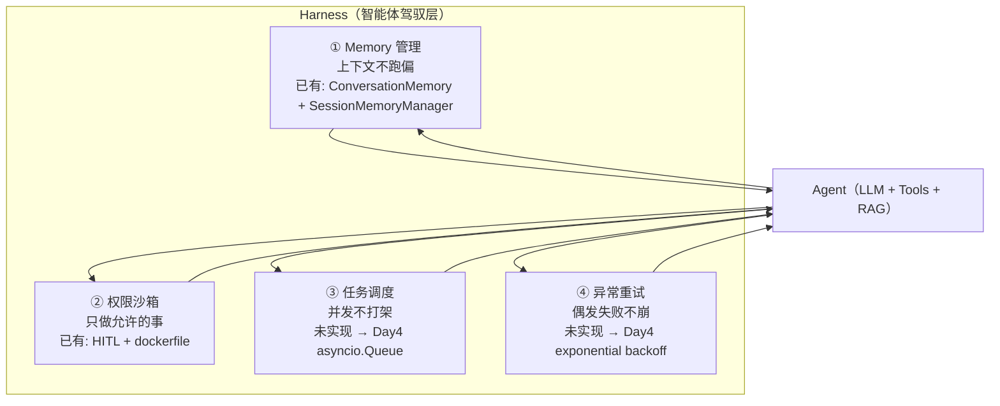

# Day 3 笔记：Harness 概念体系（智能体驾驭工程）

> 目标：理解 Harness = 让 Agent 在**生产环境稳定、安全、可控运行**的基础设施层，
> 掌握完整框架四件套（Memory 管理 / 权限沙箱 / 任务调度 / 异常重试），
> 并与本项目已有代码（`ConversationMemory` / `SessionMemoryManager` / HITL / dockerfile / `max_rounds`）做一一映射。
> 本日只讲概念 + 写笔记，**不实现代码**（Day 4 Code 模式实现 `reliability.py`）。

---

## 一、Harness 是什么？解决什么问题？

**一句话定义**：Harness（智能体驾驭工程）= 让 Agent 在**生产环境稳定、安全、可控运行**的基础设施层。

**类比：操作系统之于应用**

- 应用（你的 Agent：LLM + Tools + RAG 流水线）只管"做业务"；
- 操作系统（Harness）不管业务，只管"让应用跑得稳、跑得安全、跑得可控"——分配资源、隔离权限、调度任务、处理崩溃；
- 没有 OS 的程序只能跑在裸机上，一崩就死；没有 Harness 的 Agent 只能跑在 demo 里，一上线就翻车。

**为什么需要——Agent 生产化三大痛点**：

| 痛点 | 表现 | 对应组件 |
|------|------|---------|
| 🔴 **不稳定** | 网络抖动 / LLM 限流 / 偶发超时 → 一次失败整个回答崩掉 | **异常重试** |
| 🔴 **不安全** | Agent 拿到工具就能乱调，误操作 / 恶意操作无法拦截 | **权限沙箱** |
| 🔴 **不可控** | 上下文越聊越偏 / 多轮循环停不下来 / 多用户并发打架 | **Memory 管理 + 任务调度** |

---

## 二、Harness 四件套架构图

> 🎯 面试准备重点：这张图必须能**不看书在白板上画出来**，且能讲清每个组件的输入/输出。

### 手绘 ASCII 版（标注每个组件输入/输出）

```
┌────────────────────────────────────────────────────────────┐
│                   Harness（智能体驾驭层）                      │
│                                                            │
│  ┌──────────────┐   ┌──────────────┐   ┌───────────────┐  │
│  │ ① Memory 管理 │   │ ② 权限沙箱    │   │ ③ 任务调度      │  │
│  │  输入:对话历史 │   │  输入:工具调用 │   │  输入:并发请求   │  │
│  │  输出:有界上下文│   │  输出:放行/拦截│   │  输出:排队顺序执行│  │
│  └──────────────┘   └──────────────┘   └───────────────┘  │
│  ┌──────────────────────────────────────────────────────┐ │
│  │ ④ 异常重试: 输入=失败的LLM/网络调用 → 输出=恢复/兜底结果 │ │
│  └──────────────────────────────────────────────────────┘ │
│                                                            │
│             你的 Agent（LLM + Tools + RAG 流水线）           │
│         Memory喂上下文 → LLM决策 → 沙箱放行工具 → 结果返回    │
└────────────────────────────────────────────────────────────┘
```

### Mermaid 版



---

## 三、四组件职责对照表（含项目已有代码映射）

| 组件 | 解决什么问题 | 一句话职责 | 你已有的基础 | 本周动作 |
|------|------------|-----------|-------------|---------|
| **① Memory 管理** | Agent 记住上下文，不越跑越偏 | 管理对话状态，给 LLM 喂"有界、分会话"的上下文 | ✅ [`ConversationMemory`](app/memory/memory.py:1) + [`SessionMemoryManager`](app/memory/session_memory.py:5) | 回顾即可，不重写 |
| **② 权限沙箱** | Agent 只能做"允许做的事"，防恶意/误操作 | 给工具调用加"门卫"，拦截未授权动作 | ✅ HITL（[`research_agent_hitl.py`](app/agent/research_agent_hitl.py:198)）+ [`dockerfile`](dockerfile:1) | Day 5 深化概念 |
| **③ 任务调度** | 多用户/多任务并发不打架，优先级可控 | 把并发请求排进队列，逐个顺序执行 | ❌ 未实现 | Day 4 实战 `asyncio.Queue` |
| **④ 异常重试** | LLM/网络偶发失败不崩，自动恢复 | 失败自动重试 + 退避，超时熔断降级 | ❌ 未实现（只有裸 try/except 兜底） | Day 4 实战 exponential backoff |

---

## 四、每个组件：一句话职责 + 已做的/将做的清单

### ① Memory 管理 —— "让 Agent 记住上下文，不越跑越偏"

**已做的（✅）**：
- [`ConversationMemory`](app/memory/memory.py:1)：`messages` 列表 + `max_messages=10` 有界窗口，`_trim()`（[memory.py:49](app/memory/memory.py:49)）从头部弹旧消息——最朴素的"上下文窗口管理"，防止上下文无限膨胀；
- [`SessionMemoryManager`](app/memory/session_memory.py:14)：`sessions` 字典按 `session_id` 隔离各会话的 memory——多会话隔离，避免 A 用户上下文串到 B 用户。

**将做的（➡️）**：本日不重写；后续可扩展"对话摘要压缩"（超长历史 → LLM 提炼摘要），但那是加分项，非本周必做。

### ② 权限沙箱 —— "让 Agent 只能做允许的事，防恶意/误操作"

**已做的（✅，两道防线）**：
- **HITL 审批门**：[`research_agent_hitl.py`](app/agent/research_agent_hitl.py:198) 用 `graph.compile(checkpointer=MemorySaver(), interrupt_before=["search"])` 在搜索前暂停，等用户确认/修改子问题再恢复——"高风险动作人工确认后才执行"；
- **沙箱隔离**：[`dockerfile`](dockerfile:1) 用 `python:3.11` 镜像把 FastAPI 服务装进隔离容器，资源/进程隔离。

**将做的（➡️ Day 5）**：工具白名单（未注册工具一律拒绝）+ 工具风险分级（只读工具直接放行 / 写操作需审批）。

### ③ 任务调度 —— "让多用户/多任务并发不打架，优先级可控"

**已做的（✅）**：❌ 完全未实现。当前是单请求串行处理，多用户并发会互相阻塞。

**将做的（➡️ Day 4）**：[`week7plan.md`](week7plan.md:184) 的 `TaskQueue`——`asyncio.Queue(maxsize=10)` + `submit()` 生产任务 + `_worker()` 逐个消费，模拟 10 个并发用户验证排队顺序与不阻塞。

### ④ 异常重试 —— "让 LLM/网络偶发失败不崩，自动恢复"

**已做的（✅）**：只有"裸兜底"，没有"主动重试"：
- [`supervisor_agent.py`](app/agent/supervisor_agent.py:295)：`rag_node` 里 LLM 生成失败 → 返回检索原文兜底；
- [`supervisor_agent.py`](app/agent/supervisor_agent.py:204)：LLM 决策失败 → 回退规则判断。

**将做的（➡️ Day 4）**：
- `retry_with_backoff`（[`week7plan.md`](week7plan.md:170)）：1s → 2s → 4s + 抖动（jitter），LLM 偶发失败自动恢复；
- `run_with_timeout`（[`week7plan.md`](week7plan.md:199)）：30s 超时返回降级话术"系统繁忙，请稍后再试"，不挂死用户。

---

## 五、⭐ 加分项：项目里已有的"可靠性思想"（面试主动点出）

| 已有代码 | 属于哪类思想 | 说明 |
|---------|------------|------|
| [`supervisor_agent.py`](app/agent/supervisor_agent.py:174) 的 `max_rounds` 防失控 | **可靠性/可控性** | `rounds >= max_rounds` 强制 `finish`，防止多 Agent 无限循环——这就是"任务调度 + 可控性"的雏形 |
| [`supervisor_agent.py`](app/agent/supervisor_agent.py:94) 的 `_parse_decision` 容错 | **可靠性** | LLM 输出非法值时按关键词提取、失败回退规则——对不稳定的 LLM 输出做防御 |
| [`supervisor_agent.py`](app/agent/supervisor_agent.py:292) 的 try/except 降级 | **熔断/降级雏形** | LLM 失败返回检索原文兜底——降级策略已是熔断的雏形 |

**结论**：项目在"不可控"（max_rounds）和"降级"上已有意识，但**主动重试（backoff）** 和 **多并发调度（queue）** 是空白——正是 Day 4 要补的两块硬骨头。

---

## 六、引导思考：哪两个组件当前最缺、最容易翻车？

**答案：③ 异常重试 + ③ 任务调度**（提示："网络不稳定时 LLM 调用失败怎么办？"）

推演当前代码的真实翻车场景：

1. **网络抖一下 → LLM 调用抛一次异常 → 当前代码直接走兜底**：回答质量从"正常回答"跌到"检索原文"或"系统繁忙"，用户感知 = "变傻了"。没有 `retry_with_backoff` 前，**任何一次偶发失败都会让整个回答降级**；
2. **两个用户同时提问 → 当前单线程串行处理**：第二个用户必须干等第一个跑完（一个 RAG 请求可能好几秒），**并发场景直接打架**。没有 `asyncio.Queue` 前，多用户 = 排队 + 阻塞 + 卡死。

Memory 和沙箱已有代码打底（相对安全），**缺口在"扛得住失败"（重试）和"撑得住并发"（调度）**——即 Day 4 的 `reliability.py`。

---

## 七、面试要点（一句话背书）

> **面试官问："Agent 工程中 Harness 做什么？"**
>
> **答**：Harness = Agent 的生产基础设施层，四件套——
> **① Memory 管理**（我用 `ConversationMemory` 做有界上下文窗口 + `SessionMemoryManager` 做会话隔离）、
> **② 权限沙箱**（我用 HITL 审批门 + Docker 容器隔离）、
> **③ 任务调度**（我用 `asyncio.Queue` 做并发排队）、
> **④ 异常重试**（我用 exponential backoff + 抖动做 LLM 偶发失败自愈，超时熔断降级）。
> 一句话：让 Agent 在生产环境**稳定、安全、可控**运行。

**可背的三个关键词**：**基础设施层 / 四件套 / 稳定·安全·可控**。

---

## 八、Day 3 任务自检清单

- [x] 画出 Harness 架构图（四件套 + 每个组件输入/输出）——见第二节
- [x] 阅读 [`memory.py`](app/memory/memory.py:1) 和 [`research_agent_hitl.py`](app/agent/research_agent_hitl.py:1)，确认已有两个组件——见第三、四节
- [x] 为每个组件写"一句话职责 + 已做/将做"对照表——见第四、五节
- [x] 思考四个组件中最缺、最易翻车的两个——见第六节（异常重试 + 任务调度）
- [x] 能讲清"Agent 工程中 Harness 做什么？"——见第七节（可自测：不看笔记，白板画图 + 讲四件套）

> 下一步（Day 4）：Code 模式实现 [`app/agent/reliability.py`](app/agent/reliability.py)（`retry_with_backoff` / `TaskQueue` / `run_with_timeout`）+ 测试脚本。
