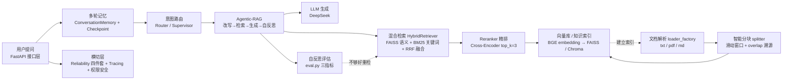

# 面试题库（interview_questions.md）

> 第 8 周产物：Week 4-8 全题库汇总。本文件已写 **RAG 专题**（Day 5）+ **Agent 专题**（Day 6）+ **系统设计 & Computer Use 新题**（Day 7），第 8 周题库收官。
>
> **做题原则（三件套）**：每道题做到 ① 能讲原理 ② 能画图 ③ 能连到自己的代码文件。"真会"与"背会"的分界 = 能否指向代码说出实现。

---

## 一、RAG 专题（Week 8 Day 5）

### Q1. 怎么分块（chunk）？有哪些策略？

**① 原理**

- **为什么分块**：LLM 上下文有限 + 单块相关性更精准 + 向量检索以"块"为最小单位返回。不分块 = 整个文档一个向量，检索只能命中整个文档，无法精准定位答案所在片段。
- **核心权衡**：`chunk_size`（越大 → 上下文信息越全但噪声越多、token 越贵；越小 → 越精准但可能截断完整语义）。
- **常见策略**：固定长度（N 字符/词/token）、滑动窗口（带 overlap）、语义切分（按段落/标题/句子边界）、递归字符切分（RecursiveCharacterTextSplitter，优先按块级边界如段落 → 再回退到句子 → 再回退到字符）。

**② 图**

```
固定切分（无重叠）         滑动窗口（带 overlap）
┌──────────┐
│ chunk1   │  [0:100]      ┌──────────────┐
└──────────┘              │   chunk1      │  [0:100]
┌──────────┐              └──────────────┘
│ chunk2   │  [100:200]       └──────────────┘  ← 后 20 字符与 chunk1 重叠
└──────────┘                  │   chunk2       │  [80:180]
                              └────────────────┘
  → 语义被切断（"…负责审批年假" / "年假的天数…"）
    两句分属两个 chunk，检索时各只命中一半
```

**③ 我的代码**：[`splitter.py`](app/rag/splitter.py:1)

```python
def split_documents(documents, chunk_size=100, overlap=20):
    chunks = []
    for doc in documents:
        text = doc["text"]; metadata = doc["metadata"]
        start = 0
        while start < len(text):
            end = min(start + chunk_size, len(text))
            chunks.append({"text": text[start:end], "metadata": metadata.copy()})
            if end == len(text): break
            start = end - overlap   # ⭐ 滑动窗口核心：start 回退 overlap
    return chunks
```

- 我的实现是**滑动窗口**：`chunk_size=100` + `overlap=20`。`start = end - overlap` 让相邻块共享 20 字符，保证"年假…"这类跨块语义不丢。
- 保留 `metadata.copy()`（来源、页码）→ 回答可溯源到原始文档。
- **面试追问①**：为什么 overlap 不能太大？→ 块与块高度重复，Embedding 后近似重复向量，浪费存储 + 检索返回一堆雷同块。
- **面试追问②**：chunk_size 按字符还是 token？→ 中文按字符合理（1 字≈1 token 偏保守）；英文通常按 token 或词。生产上更好按段落边界切，避免在句子中间截断。

---

### Q2. embedding 怎么选？为什么？

**① 原理**

- embedding 把文本映射到稠密向量空间，语义相近的文本向量距离近。它是**向量检索的地基**——模型选错，后面 RRF/Reranker 都救不回来。
- **选型维度**：语言（中文 vs 多语）、模型大小（速度/精度）、维度（越大表达越强但存储/算力越贵）、度量方式（内积 / 余弦 / L2）、是否有指令前缀要求（如 bge 系列建议给 query 加指令）。

**② 选型逻辑（我的场景：中文企业知识库）**

| 候选 | 说明 | 结论 |
| ---- | ---- | ---- |
| `text-embedding-3-small`（OpenAI） | 英文强、中文一般、需外网 API | ✗ 中文 + 离线受限 |
| `BAAI/bge-large-zh-v1.5` | 中文强，但 326M 参数偏大 | △ 精度优先可选 |
| **`BAAI/bge-small-zh-v1.5`** | 中文专用，24M 参数、轻量、效果好 | ✅ 我的选择（离线可跑 + 中文场景） |

**③ 我的代码**：[`embedding.py`](app/rag/embedding.py:1)

```python
from sentence_transformers import SentenceTransformer
model = SentenceTransformer("BAAI/bge-small-zh-v1.5")
def embed_texts(texts):
    return model.encode(texts)
```

- 中文专用模型 + small 尺寸 = 本地离线部署 + 检索质量兼顾。
- **面试追问①**：为什么不用 OpenAI 的 embedding？→ 我的场景是中文企业内部文档，bge 中文效果更好且可本地部署（数据不出内网、无每次调用的 API 成本）。这也是企业 RAG 选型的关键考量。
- **面试追问②**：内积 vs 余弦？→ bge 官方推荐把 query 归一化后用内积（等价余弦）。FAISS 的 `IndexFlatIP`（内积）或 `IndexFlatL2` 都行；我的 [`vectorstore.py`](app/rag/vectorstore.py:1) 用 `IndexFlatL2`（L2 欧氏距离）。

---

### Q3. 为什么用 rerank？怎么做？

**① 原理**

- **为什么**：向量检索返回 top_k 是"宽召回"，靠 embedding 粗粒度相似度，噪声多、精度不足；直接把这堆结果塞给 LLM 既浪费 token 又可能被噪声干扰。Reranker 用**更精细的模型/算法对"查询-文档对"逐一打分重排**，把真正相关的顶到前面。
- **召回 vs 精排**：先 `top_k=50` 宽召回（保证不漏）→ Reranker 精排取 `top_k=3`（保证准）。召回看"查全率"，精排看"查准率"。
- **两类实现**：Bi-Encoder（query 和 doc 分开编码，快但粗，就是 embedding 检索本身）/ Cross-Encoder（query 和 doc **拼接一起**过模型，交互式打分，准但慢，适合 Reranker 而非首次召回）。

**② 图**

```
        宽召回 top_k=10                 精排 top_k=3
   ┌────────────────────┐        ┌──────────────────────┐
   │ FAISS / 混合检索     │        │  Reranker            │
   │  1. doc_A (0.92)   │        │  对每对 (query,doc)   │
   │  2. doc_B (0.88)   │        │  重新打分             │
   │  3. doc_C (0.85)   │        │  1. doc_C (0.97)     │  ← 重新排序！
   │  4. doc_D (0.83)   │ ────→  │  2. doc_A (0.95)     │
   │  5. doc_E (0.80)   │        │  3. doc_B (0.90)     │
   │  ...               │        └──────────────────────┘
   └────────────────────┘              ↓ 只取前 3 进 LLM
```

**③ 我的代码**：[`reranker.py`](app/rag/reranker.py:1)

```python
class Reranker:
    def rerank(self, query, documents, top_k=3):
        scores = [(self.score(query, doc["text"]), doc) for doc in documents]
        scores.sort(key=lambda x: x[0], reverse=True)
        return [doc for _, doc in scores[:top_k]]

    def score(self, query, text):
        return len(set(query) & set(text))   # ⭐ 字符重合度（轻量实现）
```

- 我的轻量实现是**字符重合度**（query 与文本的字符交集大小）——零成本、可离线、够用。
- **升级位**：[`reranker_cross_encoder.py`](app/rag/reranker_cross_encoder.py:1) 已预留 Cross-Encoder（`bge-reranker-v2-m3`），`build_hybrid_retriever(file_path, use_cross_encoder=True)` 一键切换：慢但准，适合高质量场景。
- **面试追问**：为什么不用 Cross-Encoder 直接做首次检索？→ Cross-Encoder 要对每个 (query, doc) 拼接后过模型，语料 N 个文档就要 N 次前向，太慢；所以标准做法是 Bi-Encoder 宽召回 + Cross-Encoder 精排（召回快、精排准，成本可控）。

---

### Q4. 混合检索怎么融合？（Day 5 精讲题，必须能手写）

**① 原理**

- **问题**：向量检索（FAISS）擅长**语义泛化**（"年假"↔"带薪休假"），但抓不住**专有名词/精确关键词**（"工资什么时候发"→"工资"+"发"两个词，向量可能漏）；BM25 擅长**关键词精确匹配**，但不懂同义改写。二者**互补**。
- **RRF（Reciprocal Rank Fusion）**：不比较绝对分数（FAISS 的 L2 距离和 BM25 分数尺度完全不同，没法直接加权相加），只看**排名**。公式：

```
RRF(doc) = Σ 1/(k + rank_i(doc))     k=60（平滑常数，来自论文默认）
```

- 文档在某个列表里排名越靠前，贡献越大；只在单个列表出现也能得分（另一个列表 rank 视为无穷大，贡献 0）。**天然消除尺度差异**，无需调权重。

**② 图**

```
   Query
    │
    ├──────────────────────────────┐
    ▼                              ▼
 向量检索 (FAISS)               BM25 关键词检索
 语义泛化                       精确匹配
 擅长同义改写                    擅长专有名词
    │                              │
    ▼                              ▼
 rank:1 doc_A                    rank:1 doc_A
 rank:2 doc_C                    rank:2 doc_B
 rank:3 doc_E                    rank:3 doc_C
    │                              │
    └──────────┬───────────────────┘
               ▼
      RRF(doc) = 1/(60+r1) + 1/(60+r2)
               │
               ▼
        融合排序 → top_k=3
```

**③ 我的代码**：[`hybrid_retriever.py`](app/rag/hybrid_retriever.py:110)（`rrf_fusion`）

```python
def rrf_fusion(faiss_results, bm25_results, k=60, final_top_k=3):
    scores, doc_map = {}, {}
    for rank, doc in enumerate(faiss_results, start=1):
        key = doc["text"][:200]
        scores[key] = scores.get(key, 0) + 1.0 / (k + rank)
        doc_map.setdefault(key, doc)
    for rank, doc in enumerate(bm25_results, start=1):
        key = doc["text"][:200]
        scores[key] = scores.get(key, 0) + 1.0 / (k + rank)
        doc_map.setdefault(key, doc)
    sorted_keys = sorted(scores, key=scores.get, reverse=True)[:final_top_k]
    return [{**doc_map[k], "rrf_score": round(scores[k], 6)} for k in sorted_keys]
```

- 完整调用链在 [`HybridRetriever.retrieve()`](app/rag/hybrid_retriever.py:222)：① `model.encode([query])` → `vectorstore.search(top_k=10)` ② `jieba.cut(query)` → `BM25Retriever.search(top_k=10)` ③ `rrf_fusion(k=60, final_top_k=3)` ④ 可选 `reranker.rerank()`。
- **关键设计**：BM25 和 FAISS **共享同一份 documents**（同索引位置对应同文档），融合不串位。
- **面试追问①**：为什么 k=60？→ RRF 论文（Cormack et al.）的默认平滑常数，防止 rank=1 的文档得分过高、拉开和后续排名的差距；具体取值可调，k 越大排名差异贡献越小。
- **面试追问②**：RRF vs 加权和？→ 加权和需要归一化两路分数并调权重，尺度不同难调；RRF 只看排名，零超参、robust，业界标准做法。
- **面试追问③**：中文为什么要 jieba 分词？→ BM25 基于词统计，中文不分词会把每个汉字当"词"，完全失去词义；`list(jieba.cut("员工年假"))` → `['员工', '年假']` 才能正确计算 TF/IDF。

---

### Q5. Agentic-RAG 是什么？

**① 原理**

- **传统 RAG**：固定 `Retrieve → Generate`，一次检索一次生成，检索不到就答错，无反馈。
- **Agentic-RAG**：让 **Agent 自主决策**——是否需要检索、检索什么、检索几次。核心是两个能力：
  - **Query Rewrite（查询改写）**：多轮对话中"那我可以休多少天？"这种指代模糊问题 → 改写成独立可检索问题"公司带薪休假政策中，员工可以休多少天？"
  - **Self-Reflection（自我反思）**：生成回答后自评质量，不够好 → 自动重新检索再生成（反馈回路），用 `retry_count` 限制循环次数防死循环。

**② 图**

```
传统 RAG:                        Agentic-RAG:
┌────────────┐                  ┌───────────────────┐
│ Retrieve   │  ← 无反馈        │ Query Rewrite     │
│    ↓       │                  │    ↓              │
│ Generate   │                  │ Search (检索)      │
│    ↓       │                  │    ↓              │
│  END       │                  │ Generate          │
└────────────┘                  │    ↓              │
                                │ Reflect (自评) ──┐│
                                │    ↓ 够好         ││
                                │  END             ││
                                │  ↑ 不够 → 重检 ←──┘  (retry_count 限制)
                                └───────────────────┘
```

**③ 我的代码**：[`agentic_rag.py`](app/agent/agentic_rag.py:1)

- 4 节点：`query_rewrite_node` / `search_node` / `generate_node` / `reflection_node`（[`agentic_rag.py:69`](app/agent/agentic_rag.py:69)）。
- **关键**：`search_node` 检索的是 **`rewritten_query`（改写后问题）**，不是原始 query——这是与传统 RAG 的核心区别（[`agentic_rag.py:126`](app/agent/agentic_rag.py:126)）。
- **反馈回路**：`reflect` 节点输出 `accept`/`retry`，`should_retry` 条件边决定回 `search` 还是 `END`（[`agentic_rag.py:228`](app/agent/agentic_rag.py:228)）；`MAX_RETRY = 2` 防无限循环。
- 检索复用混合检索器 `build_hybrid_retriever`（惰性加载，首次调用才构建，[`agentic_rag.py:109`](app/agent/agentic_rag.py:109)）。
- **面试追问**：Agentic-RAG 比传统 RAG 慢，怎么取舍？→ 加 Query Rewrite 和自反思会多 2-3 次 LLM 调用，适合复杂/多轮问题；简单事实问答直接用传统 RAG，成本可控（呼应"怎么降 LLM 成本"的减调用思想）。

---

### Q6. GraphRAG 解决什么？

**① 原理**

- **传统 RAG 的盲区**：检索的是**孤立 chunk**，chunk 之间没有关系。问"哪个部门负责审批年假？"——"年假"和"人事部"可能分属两个 chunk，纯向量检索要措辞完全匹配才能把关系链串起来，容易漏。
- **GraphRAG 思路**：先做**实体抽取 + 关系抽取**建**知识图谱**（节点=实体，边=关系），检索时从问题中命中实体 → **BFS 图遍历 1-2 跳邻居** → 把"年假 →(负责审批)→ 人事部"这类跨 chunk 关系链拼进上下文。
- **适用场景**：多跳关系问答、全局性问题、需要"谁和谁什么关系"的回答。

**② 图**

```
传统 RAG（孤立 chunk）:            GraphRAG（实体关系图谱）:
┌─────────┐  ┌─────────┐         (年假) ──负责审批──> (人事部)
│ chunk1  │  │ chunk2  │           │ 规定              │ 负责
│ 年假…   │  │ 人事部… │           ▼                   ▼
└─────────┘  └─────────┘        (带薪年假)          (审批流程)
  无关系 → 检索串不起来          BFS: 年假 → 1跳: 人事部/带薪年假
```

**③ 我的代码**：[`graph_rag.py`](app/rag/graph_rag.py:1)

- 实体抽取 `extract_entities`：基于 `ENTITY_DICT` 词典（部门/制度/时间/文档 4 类）匹配（[`graph_rag.py:59`](app/rag/graph_rag.py:59)）。
- 关系抽取 `extract_relations`：一句话里同时出现 ≥2 实体 + 关系词 → 建关系三元组；**取最长匹配关系词**（"负责审批"而非"负责"，[`graph_rag.py:111`](app/rag/graph_rag.py:111)）。
- 图构建：`NetworkX`（[`graph_rag.py:125`](app/rag/graph_rag.py:125) `KnowledgeGraph`）。
- 图增强检索 `enhanced_retrieve`：实体命中 → `_bfs_neighbors`（BFS 1-2 跳）→ 拼上下文（[`graph_rag.py:176`](app/rag/graph_rag.py:176)）。
- **面试追问**：GraphRAG 的瓶颈？→ 实体/关系抽取质量决定图谱质量（我用词典+规则，覆盖有限；生产上可换 LLM 抽取），且建图有成本；适合关系密集场景，不适合纯单点事实问答。

---

### RAG 专题自检清单（Day 5 口述过关用）

| 题目 | 原理 | 画图 | 指向代码 |
| ---- | ---- | ---- | -------- |
| 怎么分块 | ✅ | ✅ 滑动窗口图 | [`splitter.py`](app/rag/splitter.py:1) |
| embedding 怎么选 | ✅ | — | [`embedding.py`](app/rag/embedding.py:1) |
| 为什么用 rerank | ✅ | ✅ 宽召回→精排图 | [`reranker.py`](app/rag/reranker.py:1) |
| 混合检索怎么融合 | ✅ | ✅ 双路→RRF 图 | [`hybrid_retriever.py`](app/rag/hybrid_retriever.py:110) |
| Agentic-RAG 是什么 | ✅ | ✅ 反馈回路图 | [`agentic_rag.py`](app/agent/agentic_rag.py:1) |
| GraphRAG 解决什么 | ✅ | ✅ 图谱 vs chunk 图 | [`graph_rag.py`](app/rag/graph_rag.py:1) |

---

## 二、Agent 专题（Week 8 Day 6）

> 题库对齐 Week 6-7：LangGraph / MCP / Multi-Agent 模式 / 监控 / Harness / 降成本。
> ⚠️ **Week 7 三题（Q4 监控 / Q5 Harness / Q6 降成本）必须能脱离笔记口述**——这是 Day 6 的硬性要求，不是"再看一遍"。

### Q1. LangGraph 是什么？怎么用？

**① 原理**

- LangGraph 是 LangChain 出的**图状态机工作流框架**：把 Agent 拆成一个个 `node`（节点=函数），用 `edge`（边）连接，节点之间共享一个 `State`（状态）。
- **与纯代码写循环（Week 5 的 AgentExecutor）的本质区别**：状态显式化 + 流程可观察、可打断、可持久化。`State` 是 TypedDict，每个节点返回 dict 增量更新；需要"追加不覆盖"的字段用 `Annotated[list, operator.add]` reducer。
- **两种典型图**：① 循环图（LLM↔Tool 反复调用，用 conditional edge 决定继续还是结束）② DAG 流水线（Planner→Search→Writer 线性无环）。

**② 图（循环图 = LLM 与 Tool 的闭环）**

```
        START
          │
          ▼
   ┌──────────────┐
   │   llm_node   │  chat_with_tools(messages, schema)
   └──────┬───────┘
          │ should_continue（条件边）
   ┌──────┴──────┐
   ▼             ▼
 tool_node      END
（执行工具）   （无 tool_calls → 结束）
   │
   └────→ 回到 llm_node（带 ToolMessage 再让 LLM 判断）
```

**③ 我的代码**：[`langgraph_agent.py`](app/agent/langgraph_agent.py:1)

```python
class AgentState(TypedDict):
    messages: Annotated[list, operator.add]   # ⭐ reducer：追加而非覆盖

def should_continue(state) -> str:
    last = state["messages"][-1]
    return "tool" if (hasattr(last, "tool_calls") and last.tool_calls) else END

graph = StateGraph(AgentState)
graph.add_node("llm", llm_node); graph.add_node("tool", tool_node)
graph.add_edge("__start__", "llm")
graph.add_conditional_edges("llm", should_continue, {"tool": "tool", END: END})
graph.add_edge("tool", "llm")                 # 循环边
langgraph_app = graph.compile()
```

- **`tool_node` 的兼容细节**：[`langgraph_agent.py:79`](app/agent/langgraph_agent.py:79) 用 `hasattr(last_message, "tool_calls")` 区分 DeepSeek 返回的**对象** vs LangChain 的 **dict**，两种格式都兼容。
- 纯代码版对照：Week 5 的 [`agent_executor.py`](app/agent/agent_executor.py:25) 用 `while` + `if response.tool_calls` 手写循环——LangGraph 把这套逻辑显式化为"图"。
- **面试追问①**：为什么用 `operator.add`？→ 循环图里每次 LLM/工具都会产出一条新消息，需要**累积**进历史；不加 reducer 会被后一个节点覆盖掉前面的消息。
- **面试追问②**：DAG 流水线也用这个吗？→ 不用。看 [`research_agent.py:36`](app/agent/research_agent.py:36) 的 `ResearchState`——普通 TypedDict（覆盖式），因为 Planner→Search→Writer 每步输出是下一步输入，没有"追加"需求。

---

### Q2. MCP 解决什么问题？

**① 原理**

- **问题**：Agent 每接一个工具就要为它写一套调用代码（API 地址、参数格式、鉴权方式各不相同），工具多了 Agent 侧代码爆炸，工具也难以复用。
- **MCP（Model Context Protocol）**：把工具调用做成**统一协议**——工具提供方（Server）按标准暴露"工具名 + 输入 Schema"，Agent 侧（Client）用统一流程发现和调用。**工具与 Agent 彻底解耦：Agent 零改动即可新增/替换工具。**
- 协议三层流程：`initialize`（握手）→ `list_tools`（发现）→ `call_tool`（调用）。

**② 图**

```
┌──────────────────────┐        ┌──────────────────────┐
│  MCP Client          │        │  MCP Server          │
│  (Agent 进程内)       │        │  (独立进程，stdio)    │
│  ① initialize 握手    │◄──────►│  MCPServer("knowledge")│
│  ② list_tools 发现    │        │  @server.tool()       │
│  ③ call_tool 调用     │        │   knowledge_search() │
└──────────────────────┘        └──────────────────────┘
      对比 Week 4 硬编码：
      旧: SearchTool().run("年假几天")   ← 进程内直接调用
      新: ClientSession.call_tool(...)   ← 协议远程调用独立进程
```

**③ 我的代码**：[`app/mcp/server.py`](app/mcp/server.py:60) + [`app/mcp/client.py`](app/mcp/client.py:44)

- Server 侧（[`server.py:60`](app/mcp/server.py:60)）：`server = MCPServer("knowledge")` + `@server.tool()` 把 `knowledge_search(query)` 注册为标准工具，底层复用混合检索器（BM25+FAISS+RRF），`server.run(transport="stdio")` 以独立进程启动。（注意：本项目 venv 装的是 mcp 2.0.0，用 `MCPServer` 而非旧版 `FastMCP`。）
- Client 侧（[`client.py:48`](app/mcp/client.py:48)）：`stdio_client` 拉起 Server 子进程 → `ClientSession` → `initialize()` → `list_tools()` 打印工具清单 → `call_tool("knowledge_search", {"query": ...})`。
- **面试追问①**：MCP 和 HTTP API 区别？→ HTTP API 每个服务一套规范，Agent 要逐个适配；MCP 统一了"发现 + 调用 + 输入 Schema"的标准，工具即插即用，是大模型应用层的"USB 接口"。
- **面试追问②**：项目里 MCP 怎么和 Tool 共存？→ 见 [`skill.py:8`](app/agent/skill.py:8) 的对比表：**Tool 是原子操作**（`ToolRegistry.get(name)` 精确查找），**Skill 是能力模块**（`SkillRegistry.discover(query)` 能力发现），MCP 是工具跨进程标准化的传输协议，三层是不同维度。

---

### Q3. Multi-Agent 有哪些模式？（Day 6 精讲题，必须能手写对比表）

**① 原理（三种模式）**

| 模式 | 结构 | 类比 | 项目参照 |
| ---- | ---- | ---- | -------- |
| ① 顺序流水线 | A → B → C 固定链路 | 工厂流水线 | [`research_agent.py`](app/agent/research_agent.py:1)（Planner→Search→Writer）|
| ② 路由器 | 意图判断 → 一次分发到专长 Agent | 前台客服分诊 | [`multi_agent_router.py`](app/agent/multi_agent_router.py:1) |
| ③ 辩论/协作 | 多 Agent 并行输出 → 协调者综合 | 评审委员会 | [`supervisor_agent.py`](app/agent/supervisor_agent.py:1) |

**关键差异**：顺序流水线**无分支**；路由器**一次条件跳转**；Supervisor **可迭代分发 + 收集 + 综合**。

**② Router vs Supervisor（面试必背对比表，来自 [`supervisor_agent.py:25`](app/agent/supervisor_agent.py:25)）**

| 维度 | Router（一次分发） | Supervisor（可迭代协作） |
| ---- | ---- | ---- |
| 分发次数 | 一次：intent_node 判断后只走一个子 Agent → END | 可迭代：子 Agent 完成后**回到 Supervisor 重新决策**，可多次派不同子 Agent |
| 是否收集 | 不收集，各子 Agent 独立产出 answer | 收集：`messages: Annotated[list, operator.add]` 追加所有子 Agent 结果 |
| 是否综合 | 无综合 | 综合：finish 时 `_compose_answer` 汇总所有结果 |
| 决策者 | intent_node 单次 LLM 意图判断 | supervisor_node 每轮都用 LLM 决策（继续派谁 / 收尾）|
| 防失控 | 无循环，天然不会无限 | `rounds / max_rounds` 计数，超限强制 finish |

**③ 我的代码**

- **顺序流水线**：[`research_agent.py:171`](app/agent/research_agent.py:171) 线性 DAG——`planner → search → writer → END`，普通 Edge 无条件跳转。
- **路由器**：[`multi_agent_router.py:265`](app/agent/multi_agent_router.py:265) —— `intent_node` 用 LLM 判断意图（失败回退 `POLICY_KEYWORDS` 规则，[`multi_agent_router.py:128`](app/agent/multi_agent_router.py:128)）→ `route_by_intent` 条件边（非法值回退 "rag"）→ 分发到 `rag_subgraph` / `research_subgraph`（两个 SubGraph 节点）→ END。
- **Supervisor**（⭐ 精讲）：[`supervisor_agent.py:343`](app/agent/supervisor_agent.py:343) 核心是两条**回到 Supervisor 的边**：

```python
g.add_conditional_edges("supervisor", route_after_supervisor,
                        {"rag": "rag", "research": "research", "finish": END})
g.add_edge("rag", "supervisor")        # ⭐ 子 Agent 完成后回来重新决策（可迭代）
g.add_edge("research", "supervisor")
```

- `supervisor_node`（[`supervisor_agent.py:147`](app/agent/supervisor_agent.py:147)）：① 轮次超限强制 finish ② LLM 决策 research/rag/finish ③ 失败回退：有子结果→finish，命中政策词→rag，否则 research ④ finish 时 `_compose_answer` 综合。
- `rag_node` / `research_node` 结果以 `"[rag] ..."` / `"[research] ..."` 追加进 messages（`operator.add` 收集不覆盖），`_sub_results` 筛选出子 Agent 产出。
- **面试追问①**：Supervisor 怎么防止无限循环？→ `rounds` 每轮 +1，`supervisor_node` 开头判断 `rounds >= max_rounds` 就强制 finish；且 `route_after_supervisor` 非法值一律回退 finish（最安全）。
- **面试追问②**：什么时候用 Router 什么时候用 Supervisor？→ 意图清晰、单点任务用 Router（快、省 token）；需要多视角/多源信息、可能要来回补充的任务用 Supervisor（大厂 Multi-Agent 常用架构）。

---

### Q4. 怎么监控 Agent 性能？（Week 7 三题之①，必须脱稿）

**① 原理**

- **两层监控**：① **追踪（Tracing）**——记录"发生了什么"（每次 LLM 调用、检索的输入/输出/耗时/token）② **评估（Evaluation）**——判断"回答得好不好"（打分数）。只有追踪没有评估，你只知道跑了，不知道效果。
- **评估三指标 ↔ RAG 三环节**（来自 [`eval.py:11`](app/observability/eval.py:11)，面试直接引用）：

| 指标 | 判断逻辑 | 对应环节 | 掉分排查方向 |
| ---- | ---- | ---- | ---- |
| Faithfulness（忠实度）| 回答每个事实都能在 context 找到依据 | 生成（LLM）| LLM 硬编 → 需"诚实回答"兜底 |
| Answer Relevance（回答相关性）| 不看 context，只比"问题 vs 回答"是否对题 | 意图对齐（query/prompt）| 答非所问 → 查 prompt |
| Context Precision（上下文精准度）| 正确答案是否在检索结果靠前位置 | 检索（Retriever）| 靠后/缺失 → 调 top_k / 重排 |

**② 图**

```
用户请求
   │
   ▼
@observe() 追踪层（双后端，透明切换）
   │  ├─ 后端 A：LangFuse 看板（库+配置齐备时）
   │  └─ 后端 B：本地 JSON 日志（app.log，降级）
   ▼
 LLM / 检索  →  span.start / span.end（耗时/token）
   │
   ▼
评估层：LLM-as-Judge（DeepSeek 打分，失败规则兜底）
   ├─ Faithfulness / Answer Relevance / Context Precision
   └─ 分数写回 LangFuse → feedback loop（可反哺调优）
```

**③ 我的代码**：[`app/observability/tracing.py`](app/observability/tracing.py:186) + [`app/observability/eval.py`](app/observability/eval.py:220)

- **双后端透明切换**：`_langfuse_configured()`（库可 import + 三项环境变量齐备）→ `BACKEND = "langfuse"`；否则 `BACKEND = "local"`（[`tracing.py:46`](app/observability/tracing.py:46)）。接口都是 `@observe()`，无外网自动降级本地 JSON 日志，不崩。
- **零侵入包装**：`traced_chat` / `traced_chat_with_tools`（能拿 token）/ `traced_retrieve`（记录命中数量 + 耗时），不修改 `app/llm.py` 一行。
- **评估双通道**：LLM-as-Judge 优先（真实 DeepSeek 打分，[`eval.py:173`](app/observability/eval.py:173) `_llm_judge`），失败/无 key 回退 2-gram 规则兜底（`_rule_faithfulness` 等，零成本可跑）。
- **feedback loop**：分数 `send_scores_to_langfuse(trace_id, scores)` 写回 trace，形成"追踪→评估→调优"闭环。
- **面试追问**：没装 LangFuse 怎么演示可观测？→ 双后端设计就是为了这点——接口一致，本地 JSON 日志记录同样的 span/指标，接真实 LangFuse 只需 `pip install langfuse` + 配三个环境变量，代码零改动。

---

### Q5. Agent 工程中 Harness 做什么？（Week 7 三题之②，必须脱稿）

**① 原理**

- Agent 由 LLM 驱动，LLM **不可靠**（偶发失败、超时、连续故障），Harness 就是给 Agent 套的**可靠性/安全壳**，保证"系统不挂死、不雪崩、可降级"。
- 我的 Harness 四件套（[`reliability.py:1`](app/agent/reliability.py:1) docstring）：**重试 / 队列 / 超时 / 熔断**。

| 组件 | 解决什么问题 | 核心机制 |
| ---- | ---- | ---- |
| `retry_with_backoff` | 偶发失败（LLM 抖动）| 指数退避 1s→2s→4s + **随机抖动** |
| `TaskQueue` | 多用户排队不互相阻塞 | asyncio.Queue(maxsize=10) + 哨兵 + 单 worker |
| `run_with_timeout(_sync)` | 超时不挂死调用方 | asyncio.wait_for / daemon 线程 join 超时 |
| `CircuitBreaker` | 持续故障（下游被打爆）| closed→open→half_open 状态机 |

**② 图**

```
调用链：请求 → TaskQueue 排队 → CircuitBreaker → retry_with_backoff → LLM/Agent → 结果/降级
                                              │
                    ┌─────────────────────────┤
                    ▼                         ▼
              偶发失败 → 重试(退避+jitter)    连续失败 → 熔断 OPEN(快速失败)
                    │                         │
                    └→ 仍失败 → run_with_timeout 超时 → 返回降级话术（不挂死）
```

**③ 我的代码**：[`reliability.py`](app/agent/reliability.py:35)

```python
def retry_with_backoff(func, max_retries=3, base_delay=1.0, ...):
    for attempt in range(max_retries):
        try:
            return func()
        except retryable as e:
            if attempt == max_retries - 1:
                raise                        # 最后一次失败：抛给上层降级
            delay = base_delay * (2 ** attempt) + random.uniform(0, 0.5)  # ⭐ jitter
            sleep(delay)
```

- **面试点（jitter 为什么必须）**：[`reliability.py:45`](app/agent/reliability.py:45) —— 所有失败请求若按相同退避时间重试，会在同一时刻再次同时打向下游，形成"惊群/雪崩"；叠加随机抖动让重试流量均匀散开。
- **TaskQueue**（[`reliability.py:79`](app/agent/reliability.py:79)）：`_SENTINEL` 哨兵通知 worker 退出、`task_done()/join()` 精确等待排空，实现优雅关闭。
- **超时**（[`reliability.py:137`](app/agent/reliability.py:137)）：async 用 `asyncio.wait_for`；同步接口用 daemon 线程 + `t.join(timeout)`，超时返回 fallback，后台线程继续跑但不阻塞调用方。
- **CircuitBreaker**（[`reliability.py:182`](app/agent/reliability.py:182)）：`closed → open（连续失败≥3）→ half_open（冷却 5s 后放一个探测请求）→ 成功回 closed / 失败回 open`；`on_state_change` 回调便于观测/告警。
- **面试追问**：重试和熔断的区别？→ 重试处理**偶发失败**（瞬时的网络抖动）；熔断处理**持续故障**（下游已挂）。熔断打开期间不消耗真实调用，冷却后小流量探测，比单纯重试更保护系统。
- **挂在主流程**：见 [`main.py:144`](app/main.py:144) `_safe_answer`——`run_with_timeout_sync` 包住 `RAGAgent.answer()`，30s 超时返回"系统繁忙"。

---

### Q6. 怎么降低 LLM 调用成本？（Week 7 三题之③，必须脱稿）

**① 原理（四大手段）**

1. **模型路由**：简单问题用小/便宜模型，复杂问题才用强模型——意图先分类再分配。
2. **缓存**：相同/相似 query 命中缓存直接返回，跳过 LLM 调用（语义缓存 or 精确缓存）。
3. **减 context**：检索只塞最相关的 top_k 片段（RRF 精排后取 top_k=3），不把整个知识库塞进 prompt；多轮记忆用 `max_messages` 裁剪历史。
4. **工具次数控制**：限制 Agent 循环轮数（`max_rounds` / `MAX_RETRY`），避免 LLM 反复空转调工具烧 token。

**② 我的代码（可指向文件逐条说）**

- **模型路由**：[`multi_agent_router.py:87`](app/agent/multi_agent_router.py:87) `intent_node` 先让 LLM 判断意图（rag/research），命中企业政策关键词的直接走 RAG 子图——不同意图走不同链路，避免所有问题都走最贵的全链路。
- **减 context（检索）**：[`hybrid_retriever.py:222`](app/rag/hybrid_retriever.py:222) `retrieve(top_k=3)`——RRF 融合 + Reranker 精排后只取 3 个片段进 prompt，而不是把命中的一堆全塞给 LLM。
- **减 context（记忆）**：[`memory.py:49`](app/memory/memory.py:49) `_trim()`——`max_messages=10`，超出从头部 pop，控制多轮上下文长度。
- **工具次数控制**：[`supervisor_agent.py:174`](app/agent/supervisor_agent.py:174) `rounds >= max_rounds` 强制收尾；[`agentic_rag.py:228`](app/agent/agentic_rag.py:228) `MAX_RETRY = 2` 限制自反思循环。
- **缓存（升级位）**：README"后续优化方向"已列"成本优化 - 缓存"，本项目目前以精确缓存思路预留，未落地实现。
- **面试追问**：模型路由会不会降质量？→ 路由只对"意图明确"的问题降级（如政策关键词问题用规则直接判定走 RAG），不确定的问题仍走 LLM 判断 + 全链路，质量优先。
- **面试追问**：还有哪些成本手段？→ 控制重试次数（max_retries 设小）、批量/异步调用、对长文档做摘要后再问、用 embedding 缓存（相同 chunk 不重复编码）。

---

### Q7. Agent 是什么？（Week 8 新题，五要素必须能各指向一个文件）

**① 原理（五要素）**

> **Agent = LLM + planning + tool + memory + environment**。面试官问"什么是 Agent"，用这五要素展开，并用你的系统举例，就是完整答案。

| 要素 | 作用 | 我系统里的落点 |
| ---- | ---- | ---- |
| **LLM** | 大脑：理解意图、推理、生成 | [`app/llm.py`](app/llm.py:17)（DeepSeek，`chat` / `chat_with_tools` / `chat_stream`）|
| **planning** | 规划：拆解任务、决策下一步 | LangGraph 工作流：[`langgraph_agent.py`](app/agent/langgraph_agent.py:125)（循环图）、[`research_agent.py`](app/agent/research_agent.py:171)（Planner→Search→Writer）|
| **tool** | 手脚：调用外部能力 | MCP + ToolRegistry：[`app/mcp/server.py`](app/mcp/server.py:63)、[`app/agent/registry.py`](app/agent/registry.py:1) |
| **memory** | 记忆：记住多轮上下文 | [`app/memory/memory.py`](app/memory/memory.py:1)（ConversationMemory）+ LangGraph Checkpoint（[`research_agent_hitl.py`](app/agent/research_agent_hitl.py:194)）|
| **environment** | 环境：感知与作用的对象 | VectorStore（[`app/rag/vectorstore.py`](app/rag/vectorstore.py:5)）+ FastAPI 接口层（[`app/main.py`](app/main.py:231)）|

**② 图**

```
                    ┌────────────────────────────┐
                    │         Agent              │
                    │  ┌────────┐  ┌──────────┐  │
        user ──▶ LLM │  │ planning│──▶ tool     │  │
        (FastAPI)    │  └────────┘  └────┬─────┘  │
                     │  ┌────────┐       │        │
                     │  │ memory │◄──────┘        │
                     │  └────────┘  执行结果回填    │
                    └──────┬─────────────────────┘
                           ▼
                    environment（向量库/外部 API）
                    感知上下文 → 反哺 LLM 下一轮
```

**③ 面试话术（可脱稿）**

> "Agent 是**以 LLM 为核心、能自主完成多步任务**的系统，五个要素缺一不可：**LLM** 负责理解和生成（我的 [`llm.py`](app/llm.py:17)），**planning** 用 LangGraph 把任务拆成节点和边（决策图/流水线），**tool** 通过 MCP 标准化调用外部能力（工具即插即用），**memory** 记录多轮对话和任务状态（`ConversationMemory` + Checkpoint），**environment** 是它感知和操作的对象（向量知识库 + API 接口）。我的项目就是这五要素的完整落地——这也是为什么它能从'单轮问答'升级成'企业级多 Agent 系统'。"

- **面试追问①**：Agent 和 RAG 的关系？→ RAG 是 Agent 的**工具之一**（知识库检索），Agent 是更上层的决策壳；我的 [`agentic_rag.py`](app/agent/agentic_rag.py:1) 就是"RAG 被 Agent 化"——检索多少次、要不要重检由 Agent 决策。
- **面试追问②**：Agent 和 Workflow 的区别？→ Workflow 是**预定义固定链路**（如 Planner→Search→Writer），Agent 是**LLM 在运行时动态决策**下一步（如循环图、Supervisor 可迭代分发）；两者可嵌套——我的 Router 子图就是"固定分发 + 子 Agent 内部自治"。

---

### Agent 专题自检清单（Day 6 口述过关用）

> ⚠️ Week 7 三题（监控/Harness/降成本）**必须能脱离笔记口述**——表格里标 🔴。

| 题目 | 原理 | 画图 | 指向代码 | 脱稿等级 |
| ---- | ---- | ---- | -------- | -------- |
| LangGraph 是什么 | ✅ | ✅ 循环图 | [`langgraph_agent.py`](app/agent/langgraph_agent.py:1) | 必会 |
| MCP 解决什么问题 | ✅ | ✅ Client/Server 图 | [`app/mcp/server.py`](app/mcp/server.py:60) | 必会 |
| Multi-Agent 有哪些模式 | ✅ | ✅ Router vs Supervisor | [`multi_agent_router.py`](app/agent/multi_agent_router.py:265)、[`supervisor_agent.py`](app/agent/supervisor_agent.py:343) | **精讲题** |
| 怎么监控 Agent 性能 | ✅ | ✅ 追踪→评估图 | [`tracing.py`](app/observability/tracing.py:186)、[`eval.py`](app/observability/eval.py:220) | 🔴 脱稿 |
| Harness 做什么 | ✅ | ✅ 四件套调用链 | [`reliability.py`](app/agent/reliability.py:35) | 🔴 脱稿 |
| 怎么降低 LLM 成本 | ✅ | — | [`multi_agent_router.py`](app/agent/multi_agent_router.py:87)、[`memory.py`](app/memory/memory.py:49) | 🔴 脱稿 |
| Agent 是什么（五要素） | ✅ | ✅ 五要素图 | [`llm.py`](app/llm.py:17) → [`langgraph_agent.py`](app/agent/langgraph_agent.py:125) → [`server.py`](app/mcp/server.py:63) → [`memory.py`](app/memory/memory.py:1) → [`vectorstore.py`](app/rag/vectorstore.py:5) | **Week 8 新题** |

---

## 三、系统设计专题（Week 8 Day 7）

> **精讲题**：`设计一个企业级 RAG 系统`。答题结构 = ① 一句话定位 ② 全链路图 ③ 逐环讲"为什么 + 我的代码"。能画出全链路、能逐环说出实现，这题就过了。

### 面试官题面

> "假如你们公司要做一个**企业级 RAG 问答系统**（多部门、多格式文档、高并发、要审计），请你从零设计一下。回答请包含：整体架构、关键技术选型、以及每一环你打算怎么做、为什么。"

### ① 一句话定位

> "企业级 RAG 的核心不是'能检索'，而是 **在准确率、成本、可靠性、安全 四个维度上都可工程化落地**。我用八环全链路：`文档解析 → 智能分块 → 混合检索 → Reranker → Agentic-RAG → 多轮记忆 → 监控评估 → 权限安全`，每一环解决一类具体问题。"

### ② 全链路图（mermaid，面试时直接画）



### ③ 逐环精讲（每环 = 为什么 + 我的代码）

#### 环节 1：文档解析（Loader）
- **为什么**：企业文档格式杂（txt / pdf / markdown / word），每种解析方式不同，必须**按扩展名分发**到对应 Loader，做到"新格式 = 加一个 Loader，零侵入"。
- **我的代码**：[`loader_factory.py`](app/rag/loader/loader_factory.py:10) `get_loader(path)` 按后缀分发——`.txt`→`TxtLoader`，`.pdf`→`PdfLoader`（pypdf），`.md`→`MarkdownLoader`，未知格式抛 `unsupported file`。
- **追问**：PDF 怎么处理表格/扫描件？→ 文字版用 pypdf 抽取；扫描件要 OCR（paddleocr/tesseract），这是企业落地的常见增强位。

#### 环节 2：智能分块（Chunking）
- **为什么**：LLM 上下文有限，检索以"块"为单位；块太大噪声多、块太小语义断。企业文档**段落即语义边界**，分块要尽量不切断完整语义。
- **我的代码**：[`splitter.py`](app/rag/splitter.py:1) 滑动窗口 `chunk_size=100, overlap=20`，`start = end - overlap` 保证跨块语义不丢；`metadata.copy()` 保留来源页码 → **回答可溯源**（企业审计必需）。
- **追问**：分块粒度怎么定？→ 事实类用短块（精准）、叙事类用长块（上下文全）；可多粒度分层索引，检索时按需取。

#### 环节 3：混合检索（Hybrid Retrieval）
- **为什么**：向量检索擅长语义泛化但抓不住精确关键词，BM25 相反——**两者互补必须融合**。融合用 **RRF（Reciprocal Rank Fusion）**：只看排名不算绝对分数，天然消除两路尺度差异，零超参。
- **我的代码**：[`hybrid_retriever.py:110`](app/rag/hybrid_retriever.py:110) `rrf_fusion(faiss_results, bm25_results, k=60, final_top_k=3)`；调用链见 [`hybrid_retriever.py:222`](app/rag/hybrid_retriever.py:222) `retrieve()`：① encode → FAISS top_k=10 ② jieba 分词 → BM25 top_k=10 ③ RRF 融合取 top_k=3。
- **追问**：为什么 top_k 先 10 后 3？→ 宽召回保证不漏（查全），精排再收敛（查准），两阶段控制进 LLM 的 token 成本。

#### 环节 4：Reranker 精排
- **为什么**：Bi-Encoder（embedding）是"宽召回"，Cross-Encoder（query+doc 拼接打分）是"精排"，后者准但慢，**不能做首次检索**，只能做最后一层精排。
- **我的代码**：轻量实现 [`reranker.py:9`](app/rag/reranker.py:9)（字符重合度，零成本可离线）；生产升级位 [`reranker_cross_encoder.py`](app/rag/reranker_cross_encoder.py:1)（`bge-reranker-v2-m3`），`build_hybrid_retriever(use_cross_encoder=True)` 一键切换。
- **追问**：Cross-Encoder 为什么慢？→ 每个 (query, doc) 对都要拼接过一遍模型，语料 N 段就要 N 次前向；所以只对 top_k=10 的候选重排，成本可控。

#### 环节 5：Agentic-RAG（检索的智能化）
- **为什么**：固定 `Retrieve→Generate` 一次检索一次生成，问"那我可以休几天"这种指代模糊问题就答错。要让它**自主决策**：改写查询、判断是否需要重检。
- **我的代码**：[`agentic_rag.py`](app/agent/agentic_rag.py:1) 4 节点 `query_rewrite → search → generate → reflect`；`search_node` 检索**改写后**问题（[`agentic_rag.py:126`](app/agent/agentic_rag.py:126)）；`reflect` 自评 + `should_retry` 条件边 + `MAX_RETRY=2` 防死循环（[`agentic_rag.py:228`](app/agent/agentic_rag.py:228)）。
- **追问**：Agentic-RAG 慢怎么办？→ 只对复杂/多轮问题启用，简单事实问答直接传统 RAG，呼应"降成本"的模型路由思想。

#### 环节 6：多轮记忆（Memory）
- **为什么**：企业用户会连续追问，不带上下文第二个问题无法回答；但记忆不能无限长（token 成本 + 噪声）。
- **我的代码**：[`memory.py`](app/memory/memory.py:1) `ConversationMemory(max_messages=10)`，`_trim()` 超出从头部 pop；接口层 [`main.py:249`](app/main.py:249) `memory_manager.get_memory(session_id)` 按会话隔离；升级位：LangGraph Checkpoint 做**状态级记忆**（[`research_agent_hitl.py:194`](app/agent/research_agent_hitl.py:194)）。
- **追问**：长会话怎么不丢早期关键信息？→ 会话级记忆 + 摘要压缩（老消息定期让 LLM 提炼成摘要，保留事实丢掉闲聊）。

#### 环节 7：监控评估（Observability）
- **为什么**：企业系统必须能回答"答得好不好、哪一环掉分"。两层：**Tracing**（记录每次调用输入/输出/耗时/token）+ **Eval**（LLM-as-Judge 打分）。
- **我的代码**：[`tracing.py:186`](app/observability/tracing.py:186) `@observe()` 双后端（LangFuse / 本地 JSON，[`tracing.py:46`](app/observability/tracing.py:46) 自动降级）；[`eval.py:220`](app/observability/eval.py:220) 三指标 Faithfulness / Answer Relevance / Context Precision ↔ RAG 三环节；失败规则兜底（2-gram）。
- **追问**：指标掉分怎么定位？→ 三指标对应三环节（见 Agent 专题 Q4 表）：Faithfulness 掉→查生成兜底，Answer Relevance 掉→查 prompt，Context Precision 掉→查检索/重排。

#### 环节 8：权限安全（Security / HITL）
- **为什么**：企业数据有权限边界 + LLM 有风险。两道：① **权限**——按部门/角色过滤检索结果，防止越权问答；② **HITL（人在回路）**——高风险操作（外部搜索/写操作）必须先暂停征求人确认，**Checkpoint 支持回溯**满足审计。
- **我的代码**：HITL 见 [`research_agent_hitl.py:208`](app/agent/research_agent_hitl.py:208) `research_interactive`——`interrupt_before=["search"]` + `MemorySaver` 三步：`invoke` 暂停 → `update_state` 注入 → `invoke(None)` 恢复；回溯见 `demo_checkpoint_replay`（[`research_agent_hitl.py:319`](app/agent/research_agent_hitl.py:319)）。
- **追问**：检索层怎么拦权限？→ 元数据带部门标签，检索加 `where` 过滤（Chroma 的 `where` 参数，[`chroma_store.py:63`](app/rag/vector_store/chroma_store.py:63)）；白名单/关键词拦截已在 supervisor 规则兜底体现。

### ④ 收尾话术（可脱稿）

> "总结：我把企业级 RAG 拆成 **八环全链路**，前四环（解析→分块→混合检索→重排）解决**检索质量**，Agentic-RAG 解决**复杂问题的智能性**，多轮记忆解决**连续对话**，监控评估解决**可观测与迭代**，权限安全解决**合规与风险**；再套一层 **Reliability 四件套**（重试/队列/超时/熔断，[`reliability.py:35`](app/agent/reliability.py:35)）保证高并发下不挂死。整个系统我用 FastAPI + LangGraph + BGE/FAISS + DeepSeek 落地，每一环都有对应代码。"

### ⑤ 系统设计自检清单

| 环节 | 为什么（原理） | 指向代码 | 状态 |
| ---- | ---- | -------- | ---- |
| 文档解析 | 多格式分发、零侵入扩展 | [`loader_factory.py`](app/rag/loader/loader_factory.py:10) | ✅ |
| 智能分块 | 语义不切断 + 溯源 | [`splitter.py`](app/rag/splitter.py:1) | ✅ |
| 混合检索 | 语义+关键词互补、RRF 融合 | [`hybrid_retriever.py`](app/rag/hybrid_retriever.py:110) | ✅ |
| Reranker | 宽召回→精排，两阶段 | [`reranker.py`](app/rag/reranker.py:9) | ✅ |
| Agentic-RAG | 改写+自反思反馈回路 | [`agentic_rag.py`](app/agent/agentic_rag.py:1) | ✅ |
| 多轮记忆 | 会话隔离 + 裁剪 | [`memory.py`](app/memory/memory.py:1) | ✅ |
| 监控评估 | Tracing + 三指标 | [`tracing.py`](app/observability/tracing.py:186)、[`eval.py`](app/observability/eval.py:220) | ✅ |
| 权限安全 | HITL + Checkpoint 回溯 | [`research_agent_hitl.py`](app/agent/research_agent_hitl.py:208) | ✅ |

---

## 四、Computer Use 新题（Week 8 Day 7 补充）

> 第 8 周新增考点。面试官问"你怎么看 Computer Use / GUI Agent"，用"**核心挑战三问**"展开，再连到自己的 MCP/Agent 体系。

### Q1. Computer Use（GUI Agent）的核心挑战有哪些？（精讲题）

**① 原理（三问框架）**

| 挑战 | 具体问题 | 我体系里的对应思考 |
| ---- | ---- | ---- |
| **视觉理解准确率** | 截图→理解界面要像素级准确（按钮在哪、图标啥意思），比理解文字难得多；小图标、重叠元素、动态界面易误判 | 类比 embedding：视觉是"界面语义的编码"，误判会像检索错 chunk 一样被放大（[`embedding.py`](app/rag/embedding.py:1) 的教训：地基错后面全错）|
| **动作空间设计** | 动作（点击/输入/拖拽/滚动）要**标准化可枚举**，否则 Agent 无法稳定复现；动作粒度（点一下 vs 打一段字）影响成功率 | 类比 MCP Tool Schema：动作空间 = 一组结构化 Tool（[`tool_schema.py`](app/agent/tool_schema.py:1)、[`app/mcp/server.py`](app/mcp/server.py:63)），Agent 在 Schema 约束内决策 |
| **安全性** | GUI Agent 能操作真实系统，误点可能造成真实损失（删文件/发邮件/转账）；必须有**权限边界 + 人在回路** | 我的 HITL 就是答案：高风险操作 interrupt 暂停征求确认 + Checkpoint 可回滚（[`research_agent_hitl.py:208`](app/agent/research_agent_hitl.py:208)）|

**② 工作闭环图（来自 [`computer_use_notes.md`](computer_use_notes.md:1)）**

```
┌────────┐  截图   ┌────────┐  理解   ┌────────┐  动作   ┌────────┐
│  屏幕   │ ──────▶ │ 视觉模型 │ ──────▶ │ 决策模型 │ ──────▶ │ 执行器  │
└────────┘         └────────┘        └────────┘        └────────┘
    ▲                                                    │
    └────────────── 再截图确认结果（闭环） ←──────────────┘
```

**③ 面试话术（可脱稿）**

> "Computer Use 让 Agent 直接从 **GUI 感知和操作真实系统**，本质是把我的 Agent 体系（LLM + planning + tool + memory + environment）从'API 世界'延伸到'屏幕世界'。核心挑战三问：**视觉理解**要把界面变成可靠输入（像 embedding 一样是地基）、**动作空间**要标准化可枚举（正好用我 MCP 的 Tool Schema 来定义）、**安全**必须 HITL + 可回滚（我的 Checkpoint 就是这个能力的雏形）。所以它不是全新的东西，而是 Agent 五要素在 GUI 场景的复用。"

- **追问①**：Computer Use 和 MCP 什么关系？→ MCP 是**标准化 API 工具协议**（稳定、可靠、首选）；Computer Use 是**屏幕级兜底**（没有 API 的老系统/跨系统场景）。业界趋势：能走 MCP 走 MCP，走不了才 GUI。二者互补。
- **追问②**：你项目里哪部分能类比？→ 我的 [`supervisor_agent.py`](app/agent/supervisor_agent.py:343) 是"决策-执行-收集"闭环，Computer Use 只是把执行器从 RAG/Research 换成"屏幕操作器"；`Skill`（能力模块，[`skill.py:67`](app/agent/skill.py:67)）设计天然支持"屏幕操作"作为一种 Skill 挂进来。
- **追问③**：代表项目知道哪些？→ OS-Copilot（FRIDAY，自建 OS 接口）、Microsoft UFO（Windows UI 自动化双 Agent）、Anthropic Claude Computer Use、OpenAI Operator（[`computer_use_notes.md`](computer_use_notes.md:1) Day 2 论文速览表）。

### 四、自检清单（Day 7 收官）

| 题目 | 原理 | 画图 | 指向文件 | 状态 |
| ---- | ---- | ---- | -------- | ---- |
| 设计一个企业级 RAG 系统 | ✅ 八环全链路 | ✅ mermaid 全链路图 | 每环指向代码（见上表） | 精讲题 |
| Computer Use 核心挑战 | ✅ 三问框架 | ✅ 工作闭环图 | [`computer_use_notes.md`](computer_use_notes.md:1)、[`research_agent_hitl.py`](app/agent/research_agent_hitl.py:208) | Week 8 新题 |
| Agent 是什么（五要素） | ✅ | ✅ 五要素图 | 见 Agent 专题 Q7 | Week 8 新题 |
