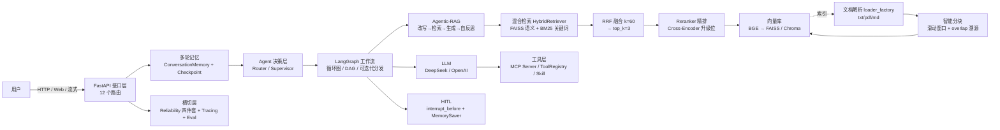

# Week 8 收官回顾（week8_review.md）

> 第 8 周（收官周）回顾：从"能用的 RAG"到"能面试的 RAG"。本文件 = **最终版全链路架构图 + 三套面试题精讲 + 8 周技术栈总表 + 面试前 24h 速查包**。

## 一、本周产出清单

| Day | 主题 | 完成内容 | 产出文件 |
| ---- | ---- | ---- | -------- |
| Day 1 | Computer Use 概念 | 工作闭环图、三要素对照表（视觉↔embedding / 动作↔Tool Schema / 记忆↔Memory+Checkpoint）、MCP vs GUI 连线题、面试话术模板 | [`computer_use_notes.md`](computer_use_notes.md:1) |
| Day 2 | Computer Use 论文速览 | OS-Copilot（FRIDAY）/ Microsoft UFO / CogAgent 三篇论文要点 + 与我的 Supervisor/Skill 连接 | [`computer_use_notes.md`](computer_use_notes.md:1)（Day 2 速览表） |
| Day 3 | 简历包装 | STAR 法则重构项目经历、8 周技术栈总结、面试预判问题（含"最高并发/最棘手 bug/如何验证"三连击） | [`resume.md`](resume.md:1) |
| Day 4 | README 精修 | mermaid 架构图、项目亮点、全链路文字版、requirements.txt 补全（mcp 2.0.0 等） | [`README.md`](README.md:1) + [`requirements.txt`](requirements.txt:1) |
| Day 5 | 面试模拟 RAG 专题 | RAG 六题（chunk/embedding/rerank/混合检索 RRK/Agentic-RAG/GraphRAG）+ RAG 自检清单 | [`interview_questions.md`](interview_questions.md:9) |
| Day 6 | 面试模拟 Agent 专题 | Agent 七题（LangGraph/MCP/Multi-Agent 模式/监控/Harness/降成本/Agent 五要素）+ Agent 自检清单 | [`interview_questions.md`](interview_questions.md:270) |
| Day 7 | 系统设计 + 收官回顾 | 企业级 RAG 系统设计八环精讲 + Computer Use 新题 + 本回顾文件 | [`interview_questions.md`](interview_questions.md) + [`week8_review.md`](week8_review.md:1) |

**本周主线叙事**：前三周做工程（检索、Agent、工程化），第 8 周全部转向**面试变现**——先补 Computer Use 新考点（Day 1-2），再包装简历（Day 3）、精修 README（Day 4），最后三天把所有技术沉淀成**能脱稿口述的面试答案**（Day 5-7）。

---

## 二、最终版全链路架构图

> 这是整个 8 周项目最终形态的"一张图"。面试开场用它立框架，之后逐环展开。



---

## 三、三套面试题精讲（题库 = [`interview_questions.md`](interview_questions.md:1)）

### 3.1 RAG 专题（6 题，Day 5）

| 题 | 一句话答案 | 指向代码 |
| ---- | ---- | -------- |
| 怎么分块 | 滑动窗口 `chunk_size=100/overlap=20`，`start=end-overlap` 保语义不切断 | [`splitter.py`](app/rag/splitter.py:1) |
| embedding 怎么选 | 中文场景选 `bge-small-zh-v1.5`（24M，离线可跑） | [`embedding.py`](app/rag/embedding.py:1) |
| 为什么 rerank | 宽召回（Bi-Encoder）→ 精排（Cross-Encoder），两阶段兼顾查全/查准 | [`reranker.py`](app/rag/reranker.py:9) |
| 混合检索怎么融合 | RRF `RRF(doc)=Σ1/(k+rank)`，k=60，只看排名消除尺度差异 | [`hybrid_retriever.py`](app/rag/hybrid_retriever.py:110) |
| Agentic-RAG | 改写→检索→生成→自反思，`MAX_RETRY=2` 反馈回路 | [`agentic_rag.py`](app/agent/agentic_rag.py:1) |
| GraphRAG | 实体/关系抽取建图 + BFS 1-2 跳邻居，解决跨 chunk 关系 | [`graph_rag.py`](app/rag/graph_rag.py:1) |

### 3.2 Agent 专题（7 题，Day 6）

| 题 | 一句话答案 | 指向代码 |
| ---- | ---- | -------- |
| LangGraph 是什么 | 图状态机工作流：节点+边+共享 State，`operator.add` 累积消息 | [`langgraph_agent.py`](app/agent/langgraph_agent.py:1) |
| MCP 解决什么 | 工具协议标准化（initialize→list_tools→call_tool），Agent 零改动接工具 | [`app/mcp/server.py`](app/mcp/server.py:60) |
| Multi-Agent 模式 | 流水线 / 路由器 / Supervisor 协作；Router 一次分发 vs Supervisor 可迭代 | [`multi_agent_router.py`](app/agent/multi_agent_router.py:265)、[`supervisor_agent.py`](app/agent/supervisor_agent.py:343) |
| 怎么监控 | Tracing（双后端）+ Eval（三指标↔RAG 三环节）+ feedback loop | [`tracing.py`](app/observability/tracing.py:186)、[`eval.py`](app/observability/eval.py:220) |
| Harness 做什么 | 重试（jitter）/ 队列（哨兵）/ 超时 / 熔断（状态机）四件套 | [`reliability.py`](app/agent/reliability.py:35) |
| 怎么降成本 | 模型路由 + 减 context（top_k=3 + _trim）+ 工具次数控制 | [`multi_agent_router.py`](app/agent/multi_agent_router.py:87)、[`memory.py`](app/memory/memory.py:49) |
| Agent 是什么 | LLM + planning + tool + memory + environment 五要素 | [`llm.py`](app/llm.py:17) → 见 Q7 五要素表 |

### 3.3 系统设计专题（1 题精讲，Day 7）

> **"设计一个企业级 RAG 系统"**：八环全链路 = 文档解析 → 智能分块 → 混合检索 → Reranker → Agentic-RAG → 多轮记忆 → 监控评估 → 权限安全。每环"为什么 + 代码"见 [`interview_questions.md`](interview_questions.md) 三、系统设计专题，此处只列骨架。

```
① Loader(多格式分发) → ② Splitter(滑动窗口) → ③ Hybrid(FAISS+BM25+RRF)
→ ④ Reranker(精排 top_k=3) → ⑤ Agentic-RAG(改写+自反思)
→ ⑥ Memory(会话隔离+裁剪) → ⑦ Observability(Tracing+三指标)
→ ⑧ Security(HITL+Checkpoint 回溯)   + 横切层 Reliability 四件套
```

- **答题结构**：一句话定位（四维度可落地）→ mermaid 全链路图 → 逐环"为什么 + 代码" → 收尾话术（八环 + 横切层总结）。
- **升级位要点**：扫描件 OCR、多粒度分块、Milvus 分布式向量库、缓存、权限按部门过滤（Chroma `where`）。

### 3.4 Computer Use 新题（Day 7 补充）

> 核心挑战三问：**视觉理解准确率**（界面输入像 embedding 一样是地基）/ **动作空间设计**（用 MCP Tool Schema 标准化可枚举）/ **安全性**（HITL + 可回滚）。工作闭环：截图→理解→决策→动作→再截图确认。详细精讲见 [`interview_questions.md`](interview_questions.md) 四、Computer Use 新题。

---

## 四、8 周技术栈总表（对照计划.md 最终技术栈，逐字）

> 这是 [`resume.md`](resume.md:1) 和面试自我介绍直接引用的"最终技术栈"，来自 [`计划.md:199`](计划.md:199)。每个分类都对应本项目的一个真实落点。

```
Languages:
Python                                        → app/ 全仓 Python 3

Backend:
FastAPI / Docker / Linux                      → app/main.py（12 路由）+ dockerfile

LLM:
OpenAI API / DeepSeek API                     → app/llm.py（chat / chat_with_tools / chat_stream）

Agent:
LangGraph / LangChain / Function Calling      → langgraph_agent.py（循环图）/ lcel_rag.py（LCEL）/ tool_schema.py

RAG:
Agentic-RAG / GraphRAG / FAISS / Milvus / Chroma
Embedding (BGE) / Reranker (Cross-Encoder)    → agentic_rag.py / graph_rag.py / vectorstore.py /
                                                 chroma_store.py / embedding.py / reranker_cross_encoder.py

Tools & Platform:
Dify / Coze / MCP / LangFuse                  → dify_notes.md / coze_notes.md / app/mcp/ / observability/tracing.py

Engineering:
Multi-Agent / Harness / Checkpoint /
Human-in-the-Loop                             → multi_agent_router.py / supervisor_agent.py / reliability.py /
                                                 research_agent_hitl.py

Frontier:
Computer Use (GUI Agent)                      → computer_use_notes.md（概念+论文速览）
```

| 技术栈分类 | 8 周落点（文件） | 面试可讲深度 |
| ---- | ---- | ---- |
| **RAG 全家桶** | [`hybrid_retriever.py`](app/rag/hybrid_retriever.py:1)、[`agentic_rag.py`](app/agent/agentic_rag.py:1)、[`graph_rag.py`](app/rag/graph_rag.py:1) | 原理+公式+代码（最强项）|
| **Agent 体系** | [`langgraph_agent.py`](app/agent/langgraph_agent.py:1)、[`multi_agent_router.py`](app/agent/multi_agent_router.py:1)、[`supervisor_agent.py`](app/agent/supervisor_agent.py:1) | 三种模式+对比表（精讲题）|
| **工程化** | [`reliability.py`](app/agent/reliability.py:1)、[`app/mcp/`](app/mcp/server.py:1)、[`skill.py`](app/agent/skill.py:1) | 四件套+协议流程（脱稿）|
| **可观测** | [`tracing.py`](app/observability/tracing.py:1)、[`eval.py`](app/observability/eval.py:1) | 双后端+三指标（脱稿）|
| **前沿** | [`computer_use_notes.md`](computer_use_notes.md:1)、[`resume.md`](resume.md:1) | 三问框架+话术（新题）|

---

## 五、自检清单（能脱稿讲哪几题）

> 用 ✅/🔴 标注自己的掌握程度。**目标是 Day 7 面试前：精讲题全部 ✅，Week 7 三题必须 🔴（脱稿）**。

| 题目 | 原理 | 画图 | 指向代码 | 脱稿等级 |
| ---- | ---- | ---- | -------- | -------- |
| 混合检索怎么融合（RRF） | ✅ | ✅ | [`hybrid_retriever.py`](app/rag/hybrid_retriever.py:110) | 🔴 精讲 |
| Agentic-RAG / GraphRAG | ✅ | ✅ | [`agentic_rag.py`](app/agent/agentic_rag.py:1)、[`graph_rag.py`](app/rag/graph_rag.py:1) | ✅ |
| Multi-Agent 三种模式 | ✅ | ✅ | [`supervisor_agent.py`](app/agent/supervisor_agent.py:25) 对比表 | 🔴 精讲 |
| 怎么监控 Agent 性能 | ✅ | ✅ | [`tracing.py`](app/observability/tracing.py:186)、[`eval.py`](app/observability/eval.py:220) | 🔴 脱稿 |
| Harness 做什么 | ✅ | ✅ | [`reliability.py`](app/agent/reliability.py:35) | 🔴 脱稿 |
| 怎么降低 LLM 成本 | ✅ | — | [`multi_agent_router.py`](app/agent/multi_agent_router.py:87)、[`memory.py`](app/memory/memory.py:49) | 🔴 脱稿 |
| Agent 是什么（五要素） | ✅ | ✅ | [`llm.py`](app/llm.py:17) → 五要素表 | ✅ 新题 |
| 设计企业级 RAG 系统 | ✅ | ✅ | 八环全链路（见三、系统设计专题） | 🔴 精讲 |
| Computer Use 核心挑战 | ✅ | ✅ | [`computer_use_notes.md`](computer_use_notes.md:1) | ✅ 新题 |

**薄弱环节标记区**：逐题自测后，把"只能看笔记、不能脱稿"的题号写在下面，面试前重点攻克：
- [ ] （示例）Q4 混合检索追问①为什么 k=60 —— 还不熟，考前再看一眼
- [ ]

---

## 六、面试前 24h 速查包（8 周所有周回顾/笔记清单）

> 面试前一晚/当天只翻这一个清单按顺序过一遍。**记忆优先级：Interview（题库）> 周回顾 > 专项笔记 > 概念笔记**。

### 6.1 面试题库（最高优先级，必须全过）
| 文件 | 内容 | 用法 |
| ---- | ---- | ---- |
| [`interview_questions.md`](interview_questions.md:1) | RAG 6 题 + Agent 7 题 + 系统设计 1 题 + Computer Use 新题 + 全部自检清单 | **主攻对象**：每题"原理+图+代码"三件套口述 |

### 6.2 周回顾（次优先级，建立全局叙事）
| 文件 | 覆盖内容 |
| ---- | ---- |
| [`week7_review.md`](week7_review.md:1) | 工程化闭环（可观测/可靠性/安全三板块精讲、熔断器状态机、手写代码清单）|
| [`week6_review.md`](week6_review.md:1) | MCP / Multi-Agent / HITL 复盘 |
| [`week5_review.md`](week5_review.md:1) | Agentic-RAG / GraphRAG / 混合检索 复盘 |
| [`week4.md`](week4.md:1) | LangGraph / LangChain 基础 |
| [`week3.md`](week3.md:1) / [`week2.md`](week2.md:1) | RAG 初版 / FastAPI 工程化 |

### 6.3 专项笔记（按简历亮点挑着看）
| 文件 | 亮点关键词 |
| ---- | ---- |
| [`resume.md`](resume.md:1) | STAR 项目经历 + 预判问题（**面试前必看**）|
| [`README.md`](README.md:1) | 项目亮点 + mermaid 架构图（项目介绍话术）|
| [`mcp_notes.md`](mcp_notes.md:1) | MCP 协议三层架构 |
| [`harness_notes.md`](harness_notes.md:1) | 可靠性四件套 |
| [`langfuse_notes.md`](langfuse_notes.md:1) | 可观测性双后端 |
| [`security_notes.md`](security_notes.md:1) | 安全三原则/三道防线 |
| [`day6_multiagent_notes.md`](day6_multiagent_notes.md:1) | Multi-Agent 模式细节 |
| [`computer_use_notes.md`](computer_use_notes.md:1) | Computer Use 概念 + 论文速览（新题）|

### 6.4 概念速记（扫一遍即可）
| 文件 | 一句话内容 |
| ---- | ---- |
| [`day1_notes.md`](day1_notes.md:1) | LangGraph 入门 |
| [`dify_notes.md`](dify_notes.md:1) / [`coze_notes.md`](coze_notes.md:1) | 低代码平台（简历"Tools & Platform"）|

### 6.5 面试前 24h 行动清单
1. **Day 5-7 题库**（interview_questions.md）三套题逐题脱稿口述一遍——这是最高 ROI。
2. **薄弱题**（见第五节自检清单）回看对应代码文件，能画出图。
3. **项目介绍**用 README 亮点 + resume STAR 过一遍 1 分钟版本。
4. **手写代码**：RRF 融合、retry_with_backoff、Supervisor 可迭代边、LangGraph 循环图——这四段必须能白板写。
5. 通读 [`week7_review.md`](week7_review.md:1) 三板块精讲，确保 Week 7 三题（监控/Harness/降成本）脱稿。

---

## 七、收官总结（8 周一句话）

> 8 周从"FastAPI + FAISS 单轮问答"升级到"**FastAPI + LangGraph + Agentic-RAG/GraphRAG + 混合检索 + MCP + Multi-Agent + Harness + 可观测 + HITL + Computer Use 认知**"的企业级 RAG Agent 系统，并沉淀出**简历（resume.md）+ 项目介绍（README.md）+ 面试题库（interview_questions.md）+ 考前速查（本文件）**四件套——具备直接投递与面试的完整材料。
